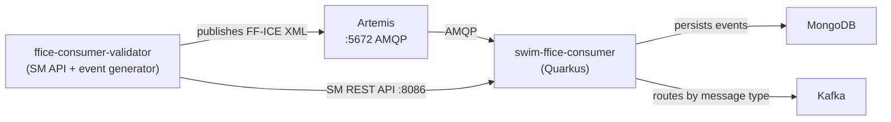

# Tutorial: Building an FF-ICE Consumer with SWIM Developer

This tutorial walks through creating a complete SWIM consumer service for FF-ICE (Flight and Flow Information for a Collaborative Environment) messages, from the data model to a running application with automated tests.

By the end, you will have four artifacts:

1. **fixm-ffice-model** - JAXB data model generated from FIXM 4.3 + FF-ICE 1.1 XSD schemas
2. **swim-outbox-kafka-ffice** - EP3 outbox extension that classifies and routes FF-ICE events to domain-specific Kafka topics
3. **swim-ffice-consumer** - Quarkus consumer service that receives, validates, persists, and routes FF-ICE messages
4. **swim-ffice-consumer-validator** - Mock Subscription Manager + event generator for local development and testing

## Prerequisites

| Tool | Version | Purpose |
|------|---------|---------|
| JDK | 21+ | Runtime and compilation |
| Maven | 3.9+ | Build system |
| Git | 2.40+ | Source control |
| [Podman Desktop](https://podman-desktop.io) | Latest | Container runtime (includes Podman engine + GUI, available for Linux, macOS, and Windows) |
| mkcert | Latest | Local TLS certificate generation |

All commands in this tutorial are shown for Linux/macOS. Windows equivalents are provided where they differ (primarily `mvnw.cmd` instead of `./mvnw`). On Windows, [Git Bash](https://gitforwindows.org/) or [WSL](https://learn.microsoft.com/en-us/windows/wsl/) can be used to run shell scripts (e.g., `certs/generate.sh`).

## Setup: Install Dependencies

Each SWIM Developer component lives in its own Git repository. Clone and install only what you need.

### Parent POM

```bash
git clone https://github.com/swim-developer/swim-developer
cd swim-developer
./mvnw clean install -DskipTests        # Linux / macOS
mvnw.cmd clean install -DskipTests      # Windows
```

### Framework

```bash
git clone https://github.com/swim-developer/swim-developer-framework
cd swim-developer-framework
./mvnw clean install -DskipTests        # Linux / macOS
mvnw.cmd clean install -DskipTests      # Windows
```

### Extensions

```bash
git clone https://github.com/swim-developer/swim-developer-extensions
cd swim-developer-extensions
./mvnw clean install -DskipTests        # Linux / macOS
mvnw.cmd clean install -DskipTests      # Windows
```

### Validators

```bash
git clone https://github.com/swim-developer/swim-developer-validators
cd swim-developer-validators
./mvnw clean install -DskipTests        # Linux / macOS
mvnw.cmd clean install -DskipTests      # Windows
```

### Model Archetype

```bash
git clone https://github.com/swim-developer/swim-model-archetype
cd swim-model-archetype
mvn clean install
```

### Consumer Archetype

```bash
git clone https://github.com/swim-developer/swim-consumer-archetype
cd swim-consumer-archetype
mvn clean install
```

After this setup, all artifacts are in your local Maven repository (`~/.m2/repository`). You can work from any directory going forward.

---

## Part 1: Data Model (fixm-ffice-model)

### 1.1 Download the XSD schemas

Download the FIXM 4.3 + FF-ICE 1.1 schemas from [fixm.aero](https://www.fixm.aero/). The distribution contains three top-level directories:

```
schemas/
  core/         FIXM 4.3 core (base types, flight types)
  applications/ FF-ICE Application 1.1 (message types, templates)
  extensions/   Bug fix extensions
```

### 1.2 Generate the model project

Choose a working directory for your new project and run:

```bash
mvn archetype:generate \
  -DarchetypeGroupId=com.github.swim-developer \
  -DarchetypeArtifactId=swim-model-archetype \
  -DarchetypeVersion=1.0.0-SNAPSHOT \
  -DgroupId=com.github.swim-developer \
  -DartifactId=fixm-ffice-model \
  -Dversion=1.0.0-SNAPSHOT \
  -Dpackage=aero.fixm.ffice \
  -DmodelName=ffice \
  -DmodelDisplayName="FF-ICE" \
  -DmodelPrefix=Ffice \
  -DrootSchema=FficeMessage.xsd \
  -DdataStandard=FIXM \
  -DinteractiveMode=false
```

Enter the generated project:

```bash
cd fixm-ffice-model
chmod +x mvnw                            # Linux / macOS only
```

On Windows, use `mvnw.cmd` instead of `./mvnw` in all subsequent commands. The `chmod` step is not needed.

### 1.3 Copy the XSD schemas

Copy the three directories from the FIXM distribution into `src/main/resources/schemas/`. Use your file manager or the appropriate command for your OS:

```bash
# Linux / macOS
cp -r /path/to/fixm-distribution/schemas/core       src/main/resources/schemas/
cp -r /path/to/fixm-distribution/schemas/applications src/main/resources/schemas/
cp -r /path/to/fixm-distribution/schemas/extensions  src/main/resources/schemas/
```

```powershell
# Windows (PowerShell)
Copy-Item -Recurse C:\path\to\fixm-distribution\schemas\core       src\main\resources\schemas\
Copy-Item -Recurse C:\path\to\fixm-distribution\schemas\applications src\main\resources\schemas\
Copy-Item -Recurse C:\path\to\fixm-distribution\schemas\extensions  src\main\resources\schemas\
```

The final structure should be:

```
src/main/resources/schemas/
  core/
    base/          Base.xsd, Types.xsd, AeronauticalReference.xsd, ...
    flight/        Flight.xsd, Arrival.xsd, Departure.xsd, ...
  applications/
    fficemessage/  FficeMessage.xsd
      fficetemplates/
        filedflightplan/
        flightdeparture/
        ...
  extensions/
    fficemessagebugfix/  FficeMessageBugFix.xsd
```

### 1.4 Configure the JAXB binding file

Edit `src/main/resources/bindings/ffice.xjb` to map each XSD namespace to a Java package:

```xml
<?xml version="1.0" encoding="UTF-8"?>
<jaxb:bindings xmlns:jaxb="https://jakarta.ee/xml/ns/jaxb"
               xmlns:xjc="http://java.sun.com/xml/ns/jaxb/xjc"
               xmlns:xs="http://www.w3.org/2001/XMLSchema"
               jaxb:extensionBindingPrefixes="xjc"
               version="3.0">

    <jaxb:globalBindings>
        <xjc:serializable uid="1"/>
    </jaxb:globalBindings>

    <jaxb:bindings schemaLocation="../schemas/applications/fficemessage/FficeMessage.xsd" node="/xs:schema">
        <jaxb:schemaBindings>
            <jaxb:package name="aero.fixm.ffice"/>
        </jaxb:schemaBindings>
    </jaxb:bindings>

    <jaxb:bindings schemaLocation="../schemas/core/base/Base.xsd" node="/xs:schema">
        <jaxb:schemaBindings>
            <jaxb:package name="aero.fixm.base"/>
        </jaxb:schemaBindings>
    </jaxb:bindings>

    <jaxb:bindings schemaLocation="../schemas/core/flight/Flight.xsd" node="/xs:schema">
        <jaxb:schemaBindings>
            <jaxb:package name="aero.fixm.flight"/>
        </jaxb:schemaBindings>
    </jaxb:bindings>

    <jaxb:bindings schemaLocation="../schemas/extensions/fficemessagebugfix/FficeMessageBugFix.xsd" node="/xs:schema">
        <jaxb:schemaBindings>
            <jaxb:package name="aero.fixm.ffice.bugfix"/>
        </jaxb:schemaBindings>
    </jaxb:bindings>

</jaxb:bindings>
```

### 1.5 Configure the JAXB Maven plugin

In `pom.xml`, update the `schemaIncludes` inside the `generate-xjc` profile to point to your root schemas:

```xml
<schemaIncludes>
    <include>applications/fficemessage/FficeMessage.xsd</include>
    <include>extensions/fficemessagebugfix/FficeMessageBugFix.xsd</include>
</schemaIncludes>
```

Update the `clean-generated-sources` execution to list the generated packages:

```xml
<target>
    <delete dir="${project.basedir}/src/main/java/aero/fixm/base" failonerror="false"/>
    <delete dir="${project.basedir}/src/main/java/aero/fixm/flight" failonerror="false"/>
    <delete dir="${project.basedir}/src/main/java/aero/fixm/ffice/bugfix" failonerror="false"/>
    <delete failonerror="false">
        <fileset dir="${project.basedir}/src/main/java/aero/fixm/ffice" includes="*.java"/>
    </delete>
</target>
```

### 1.6 Generate JAXB classes

```bash
./mvnw process-sources -Pgenerate-xjc        # Linux / macOS
mvnw.cmd process-sources -Pgenerate-xjc      # Windows
```

This generates Java classes from the XSD schemas and copies them into `src/main/java/`. The hand-written `FficeUnmarshallerPool` and `FficeXsdValidator` in the `validation` package are preserved.

### 1.7 Update the UnmarshallerPool

Edit `src/main/java/aero/fixm/ffice/validation/FficeUnmarshallerPool.java` and register all generated `ObjectFactory` classes in the `JAXBContext`:

```java
this.jaxbContext = JAXBContext.newInstance(
    aero.fixm.ffice.ObjectFactory.class,
    aero.fixm.base.ObjectFactory.class,
    aero.fixm.flight.ObjectFactory.class,
    aero.fixm.ffice.bugfix.ObjectFactory.class);
```

Set the `ROOT_XSD` constant to match the path of your root schema on the classpath:

```java
private static final String ROOT_XSD = "schemas/applications/fficemessage/FficeMessage.xsd";
```

### 1.8 Build and install

```bash
./mvnw clean install -DskipTests        # Linux / macOS
mvnw.cmd clean install -DskipTests      # Windows
```

---

## Part 2: Outbox Extension (swim-outbox-kafka-ffice)

The consumer needs an outbox router to classify processed events and send them to the correct Kafka topic. This is Extension Point EP3.

You cloned `swim-developer-extensions` during Setup. Navigate to that directory.

### 2.1 Create the module

Inside the `swim-developer-extensions` repository, create the directory structure:

```
swim-outbox-kafka-ffice/
  pom.xml
  src/main/java/com/github/swim_developer/extension/outbox/kafka/ffice/
    FficeEventCategory.java
    FficeMessageClassifier.java
    FficeKafkaOutboxRouter.java
```

#### pom.xml

```xml
<?xml version="1.0" encoding="UTF-8"?>
<project xmlns="http://maven.apache.org/POM/4.0.0" xmlns:xsi="http://www.w3.org/2001/XMLSchema-instance"
         xsi:schemaLocation="http://maven.apache.org/POM/4.0.0 https://maven.apache.org/xsd/maven-4.0.0.xsd">
    <modelVersion>4.0.0</modelVersion>

    <parent>
        <groupId>com.github.swim-developer</groupId>
        <artifactId>swim-extensions</artifactId>
        <version>1.0.0-SNAPSHOT</version>
        <relativePath>../pom.xml</relativePath>
    </parent>

    <artifactId>swim-outbox-kafka-ffice</artifactId>
    <name>SWIM Extension - Outbox Kafka FF-ICE</name>
    <description>SwimOutboxRouter implementation that dispatches FF-ICE outbox events to Kafka topics by message type.</description>

    <dependencies>
        <dependency>
            <groupId>com.github.swim-developer</groupId>
            <artifactId>swim-framework-core</artifactId>
        </dependency>
        <dependency>
            <groupId>io.quarkus</groupId>
            <artifactId>quarkus-messaging-kafka</artifactId>
        </dependency>
        <dependency>
            <groupId>org.projectlombok</groupId>
            <artifactId>lombok</artifactId>
            <scope>provided</scope>
        </dependency>
    </dependencies>

    <build>
        <plugins>
            <plugin>
                <groupId>io.smallrye</groupId>
                <artifactId>jandex-maven-plugin</artifactId>
                <version>3.5.3</version>
                <executions>
                    <execution>
                        <id>make-index</id>
                        <goals><goal>jandex</goal></goals>
                    </execution>
                </executions>
            </plugin>
        </plugins>
    </build>
</project>
```

#### FficeEventCategory.java

```java
package com.github.swim_developer.extension.outbox.kafka.ffice;

public enum FficeEventCategory {
    FLIGHT_PLAN,
    FLIGHT_UPDATE,
    OPERATIONS,
    TRIAL,
    SUBMISSION,
    DATA,
    UNKNOWN
}
```

#### FficeMessageClassifier.java

Classifies an XML payload by inspecting the `<ffice:type>` element value:

| XML type value | Category |
|---|---|
| `FILED_FLIGHT_PLAN`, `PRELIMINARY_FLIGHT_PLAN` | `FLIGHT_PLAN` |
| `FLIGHT_PLAN_UPDATE`, `PLANNING_STATUS`, `FILING_STATUS` | `FLIGHT_UPDATE` |
| `FLIGHT_DEPARTURE`, `FLIGHT_ARRIVAL`, `FLIGHT_CANCELLATION` | `OPERATIONS` |
| `TRIAL_REQUEST`, `TRIAL_RESPONSE` | `TRIAL` |
| `SUBMISSION_RESPONSE` | `SUBMISSION` |
| `FLIGHT_DATA_REQUEST`, `FLIGHT_DATA_RESPONSE` | `DATA` |
| anything else | `UNKNOWN` |

```java
package com.github.swim_developer.extension.outbox.kafka.ffice;

public final class FficeMessageClassifier {

    private static final String UNKNOWN_VALUE = "unknown";

    private FficeMessageClassifier() {
    }

    public static FficeEventCategory classify(String xml) {
        if (containsMessageType(xml, "FILED_FLIGHT_PLAN") || containsMessageType(xml, "PRELIMINARY_FLIGHT_PLAN")) {
            return FficeEventCategory.FLIGHT_PLAN;
        }
        if (containsMessageType(xml, "FLIGHT_PLAN_UPDATE") || containsMessageType(xml, "PLANNING_STATUS")
                || containsMessageType(xml, "FILING_STATUS")) {
            return FficeEventCategory.FLIGHT_UPDATE;
        }
        if (containsMessageType(xml, "FLIGHT_DEPARTURE") || containsMessageType(xml, "FLIGHT_ARRIVAL")
                || containsMessageType(xml, "FLIGHT_CANCELLATION")) {
            return FficeEventCategory.OPERATIONS;
        }
        if (containsMessageType(xml, "TRIAL_REQUEST") || containsMessageType(xml, "TRIAL_RESPONSE")) {
            return FficeEventCategory.TRIAL;
        }
        if (containsMessageType(xml, "SUBMISSION_RESPONSE")) {
            return FficeEventCategory.SUBMISSION;
        }
        if (containsMessageType(xml, "FLIGHT_DATA_REQUEST") || containsMessageType(xml, "FLIGHT_DATA_RESPONSE")) {
            return FficeEventCategory.DATA;
        }
        return FficeEventCategory.UNKNOWN;
    }

    public static String extractGufi(String xml) {
        int start = xml.indexOf("<globallyUniqueFlightIdentifier>");
        if (start == -1) {
            int nsStart = xml.indexOf(":globallyUniqueFlightIdentifier>");
            if (nsStart == -1) return UNKNOWN_VALUE;
            start = xml.indexOf(">", nsStart) + 1;
        } else {
            start += "<globallyUniqueFlightIdentifier>".length();
        }
        int end = xml.indexOf("</", start);
        if (end == -1) return UNKNOWN_VALUE;
        String value = xml.substring(start, end).trim();
        return value.isEmpty() ? UNKNOWN_VALUE : value;
    }

    private static boolean containsMessageType(String xml, String type) {
        return xml.contains(">" + type + "<") || xml.contains("\"" + type + "\"");
    }
}
```

#### FficeKafkaOutboxRouter.java

```java
package com.github.swim_developer.extension.outbox.kafka.ffice;

import com.github.swim_developer.framework.infrastructure.out.messaging.AbstractOutboxRouter;
import io.micrometer.core.instrument.MeterRegistry;
import io.smallrye.reactive.messaging.kafka.Record;
import jakarta.enterprise.context.ApplicationScoped;
import jakarta.inject.Inject;
import lombok.extern.slf4j.Slf4j;
import org.eclipse.microprofile.reactive.messaging.Channel;
import org.eclipse.microprofile.reactive.messaging.Emitter;

@Slf4j
@ApplicationScoped
public class FficeKafkaOutboxRouter extends AbstractOutboxRouter {

    private final Emitter<Record<String, String>> flightPlanEmitter;
    private final Emitter<Record<String, String>> flightUpdateEmitter;
    private final Emitter<Record<String, String>> operationsEmitter;
    private final Emitter<Record<String, String>> trialEmitter;
    private final Emitter<Record<String, String>> submissionEmitter;
    private final Emitter<Record<String, String>> dataEmitter;
    private final Emitter<Record<String, String>> dlqEmitter;

    @Inject
    public FficeKafkaOutboxRouter(
            MeterRegistry meterRegistry,
            @Channel("out-flight-plan") Emitter<Record<String, String>> flightPlanEmitter,
            @Channel("out-flight-update") Emitter<Record<String, String>> flightUpdateEmitter,
            @Channel("out-operations") Emitter<Record<String, String>> operationsEmitter,
            @Channel("out-trial") Emitter<Record<String, String>> trialEmitter,
            @Channel("out-submission") Emitter<Record<String, String>> submissionEmitter,
            @Channel("out-data") Emitter<Record<String, String>> dataEmitter,
            @Channel("out-ffice-dlq") Emitter<Record<String, String>> dlqEmitter) {
        super(meterRegistry);
        this.flightPlanEmitter = flightPlanEmitter;
        this.flightUpdateEmitter = flightUpdateEmitter;
        this.operationsEmitter = operationsEmitter;
        this.trialEmitter = trialEmitter;
        this.submissionEmitter = submissionEmitter;
        this.dataEmitter = dataEmitter;
        this.dlqEmitter = dlqEmitter;
    }

    @Override
    public void route(String messageId, String payload) {
        FficeEventCategory category = FficeMessageClassifier.classify(payload);
        String gufi = FficeMessageClassifier.extractGufi(payload);

        incrementCounter("ffice_events_processed_total", "type", category.name(), "gufi", gufi);

        Record<String, String> kafkaRecord = Record.of(messageId, payload);
        String topicName = emit(category, kafkaRecord);

        log.debug("FF-ICE event sent to Kafka - MessageId: {}, Topic: {}, Category: {}, GUFI: {}",
                messageId, topicName, category, gufi);
    }

    private String emit(FficeEventCategory category, Record<String, String> kafkaRecord) {
        return switch (category) {
            case FLIGHT_PLAN -> {
                flightPlanEmitter.send(kafkaRecord);
                yield "ffice-flight-plan-topic";
            }
            case FLIGHT_UPDATE -> {
                flightUpdateEmitter.send(kafkaRecord);
                yield "ffice-flight-update-topic";
            }
            case OPERATIONS -> {
                operationsEmitter.send(kafkaRecord);
                yield "ffice-operations-topic";
            }
            case TRIAL -> {
                trialEmitter.send(kafkaRecord);
                yield "ffice-trial-topic";
            }
            case SUBMISSION -> {
                submissionEmitter.send(kafkaRecord);
                yield "ffice-submission-topic";
            }
            case DATA -> {
                dataEmitter.send(kafkaRecord);
                yield "ffice-data-topic";
            }
            default -> {
                dlqEmitter.send(kafkaRecord);
                yield "ffice-dlq-topic";
            }
        };
    }

    @Override
    protected Emitter<Record<String, String>> getDlqEmitter() {
        return dlqEmitter;
    }

    @Override
    protected String getServiceLabel() {
        return "FF-ICE";
    }
}
```

### 2.2 Register the module

Add the new module to the parent `pom.xml` of `swim-developer-extensions`:

```xml
<module>swim-outbox-kafka-ffice</module>
```

### 2.3 Build and install

From the `swim-developer-extensions` directory:

```bash
./mvnw clean install -DskipTests        # Linux / macOS
mvnw.cmd clean install -DskipTests      # Windows
```

---

## Part 3: Consumer Service (swim-ffice-consumer)

### 3.1 Generate the project

Choose a working directory for your new project and run:

```bash
mvn archetype:generate \
  -DarchetypeGroupId=com.github.swim-developer \
  -DarchetypeArtifactId=swim-consumer-archetype \
  -DarchetypeVersion=1.0.0-SNAPSHOT \
  -DgroupId=com.github.swim_developer \
  -DartifactId=swim-ffice-consumer \
  -Dversion=1.0.0-SNAPSHOT \
  -DserviceName=ffice \
  -DserviceDisplayName="FF-ICE" \
  -DservicePrefix=Ffice \
  -DdataModel=FIXM \
  -DcollectionPrefix=ffice \
  -DinteractiveMode=false
```

Enter the generated project:

```bash
cd swim-ffice-consumer
chmod +x mvnw                            # Linux / macOS only
```

On Windows, use `mvnw.cmd` instead of `./mvnw` in all subsequent commands.

The archetype generates 38 Java classes. 10 require domain-specific implementation. The remaining 28 work out of the box.

### 3.2 Add dependencies to pom.xml

Add these dependencies:

```xml
<dependency>
    <groupId>com.github.swim-developer</groupId>
    <artifactId>fixm-ffice-model</artifactId>
    <version>${project.version}</version>
</dependency>
<dependency>
    <groupId>com.github.swim-developer</groupId>
    <artifactId>swim-outbox-kafka-ffice</artifactId>
    <version>${project.version}</version>
</dependency>
<dependency>
    <groupId>com.github.swim-developer</groupId>
    <artifactId>swim-inbox-store-kafka</artifactId>
    <version>${project.version}</version>
</dependency>
<dependency>
    <groupId>com.github.swim-developer</groupId>
    <artifactId>swim-inbox-reader-kafka</artifactId>
    <version>${project.version}</version>
</dependency>
<dependency>
    <groupId>com.github.swim-developer</groupId>
    <artifactId>swim-framework-persistence-mongodb</artifactId>
    <version>${project.version}</version>
</dependency>
```

The Jandex index entries for these modules (so Quarkus discovers their beans) are added in Step 3.3 together with the Kafka channel configuration.

### 3.3 Configure Kafka serializers

In `application.properties`, add the following outgoing Kafka channels (connectors, topics, serializers, compression, and acks) for default event routing and FF-ICE domain outbox routing:

```properties
mp.messaging.outgoing.out-events.connector=smallrye-kafka
mp.messaging.outgoing.out-events.topic=ffice-events-topic
mp.messaging.outgoing.out-events.value.serializer=org.apache.kafka.common.serialization.StringSerializer
mp.messaging.outgoing.out-events.key.serializer=org.apache.kafka.common.serialization.StringSerializer
mp.messaging.outgoing.out-events.compression.type=lz4
mp.messaging.outgoing.out-events.acks=1
mp.messaging.outgoing.out-events.max-inflight-messages=${KAFKA_MAX_INFLIGHT:0}
mp.messaging.outgoing.out-events.buffer-size=${KAFKA_BUFFER_SIZE:2048}
mp.messaging.outgoing.out-events.waitForWriteCompletion=false
mp.messaging.outgoing.out-events.tracing-enabled=true

mp.messaging.outgoing.out-dlq.connector=smallrye-kafka
mp.messaging.outgoing.out-dlq.topic=ffice-events-dlq-topic
mp.messaging.outgoing.out-dlq.value.serializer=org.apache.kafka.common.serialization.StringSerializer
mp.messaging.outgoing.out-dlq.key.serializer=org.apache.kafka.common.serialization.StringSerializer
mp.messaging.outgoing.out-dlq.compression.type=lz4
mp.messaging.outgoing.out-dlq.acks=1
mp.messaging.outgoing.out-dlq.max-inflight-messages=${KAFKA_MAX_INFLIGHT:0}
mp.messaging.outgoing.out-dlq.buffer-size=${KAFKA_BUFFER_SIZE:2048}
mp.messaging.outgoing.out-dlq.waitForWriteCompletion=false
mp.messaging.outgoing.out-dlq.tracing-enabled=true

mp.messaging.outgoing.out-flight-plan.connector=smallrye-kafka
mp.messaging.outgoing.out-flight-plan.topic=ffice-flight-plan-topic
mp.messaging.outgoing.out-flight-plan.value.serializer=org.apache.kafka.common.serialization.StringSerializer
mp.messaging.outgoing.out-flight-plan.key.serializer=org.apache.kafka.common.serialization.StringSerializer
mp.messaging.outgoing.out-flight-plan.compression.type=lz4
mp.messaging.outgoing.out-flight-plan.acks=1

mp.messaging.outgoing.out-flight-update.connector=smallrye-kafka
mp.messaging.outgoing.out-flight-update.topic=ffice-flight-update-topic
mp.messaging.outgoing.out-flight-update.value.serializer=org.apache.kafka.common.serialization.StringSerializer
mp.messaging.outgoing.out-flight-update.key.serializer=org.apache.kafka.common.serialization.StringSerializer
mp.messaging.outgoing.out-flight-update.compression.type=lz4
mp.messaging.outgoing.out-flight-update.acks=1

mp.messaging.outgoing.out-operations.connector=smallrye-kafka
mp.messaging.outgoing.out-operations.topic=ffice-operations-topic
mp.messaging.outgoing.out-operations.value.serializer=org.apache.kafka.common.serialization.StringSerializer
mp.messaging.outgoing.out-operations.key.serializer=org.apache.kafka.common.serialization.StringSerializer
mp.messaging.outgoing.out-operations.compression.type=lz4
mp.messaging.outgoing.out-operations.acks=1

mp.messaging.outgoing.out-trial.connector=smallrye-kafka
mp.messaging.outgoing.out-trial.topic=ffice-trial-topic
mp.messaging.outgoing.out-trial.value.serializer=org.apache.kafka.common.serialization.StringSerializer
mp.messaging.outgoing.out-trial.key.serializer=org.apache.kafka.common.serialization.StringSerializer
mp.messaging.outgoing.out-trial.compression.type=lz4
mp.messaging.outgoing.out-trial.acks=1

mp.messaging.outgoing.out-submission.connector=smallrye-kafka
mp.messaging.outgoing.out-submission.topic=ffice-submission-topic
mp.messaging.outgoing.out-submission.value.serializer=org.apache.kafka.common.serialization.StringSerializer
mp.messaging.outgoing.out-submission.key.serializer=org.apache.kafka.common.serialization.StringSerializer
mp.messaging.outgoing.out-submission.compression.type=lz4
mp.messaging.outgoing.out-submission.acks=1

mp.messaging.outgoing.out-data.connector=smallrye-kafka
mp.messaging.outgoing.out-data.topic=ffice-data-topic
mp.messaging.outgoing.out-data.value.serializer=org.apache.kafka.common.serialization.StringSerializer
mp.messaging.outgoing.out-data.key.serializer=org.apache.kafka.common.serialization.StringSerializer
mp.messaging.outgoing.out-data.compression.type=lz4
mp.messaging.outgoing.out-data.acks=1

mp.messaging.outgoing.out-ffice-dlq.connector=smallrye-kafka
mp.messaging.outgoing.out-ffice-dlq.topic=ffice-dlq-topic
mp.messaging.outgoing.out-ffice-dlq.value.serializer=org.apache.kafka.common.serialization.StringSerializer
mp.messaging.outgoing.out-ffice-dlq.key.serializer=org.apache.kafka.common.serialization.StringSerializer
mp.messaging.outgoing.out-ffice-dlq.compression.type=lz4
mp.messaging.outgoing.out-ffice-dlq.acks=1
```

Add Jandex index entries for external modules (model, outbox extension, inbox store, inbox reader):

```properties
# =============================================================================
# Jandex Index - External Modules
# =============================================================================
quarkus.index-dependency.fixm-ffice-model.group-id=com.github.swim-developer
quarkus.index-dependency.fixm-ffice-model.artifact-id=fixm-ffice-model
quarkus.index-dependency.swim-outbox-kafka-ffice.group-id=com.github.swim-developer
quarkus.index-dependency.swim-outbox-kafka-ffice.artifact-id=swim-outbox-kafka-ffice
quarkus.index-dependency.swim-inbox-store-kafka.group-id=com.github.swim-developer
quarkus.index-dependency.swim-inbox-store-kafka.artifact-id=swim-inbox-store-kafka
quarkus.index-dependency.swim-inbox-reader-kafka.group-id=com.github.swim-developer
quarkus.index-dependency.swim-inbox-reader-kafka.artifact-id=swim-inbox-reader-kafka
```

### 3.4 Register the Caffeine cache

The framework uses Quarkus Caffeine cache for idempotency. The cache declared in `application.properties` is only initialized at build time if referenced by a `@CacheName` annotation. Create a simple registration bean:

```java
package com.github.swim_developer.infrastructure;

import io.quarkus.cache.CacheName;
import io.quarkus.cache.Cache;
import jakarta.enterprise.context.ApplicationScoped;

@ApplicationScoped
public class CacheRegistration {

    @CacheName("processed-messages")
    Cache processedMessagesCache;
}
```

### 3.5 Implement the 10 domain classes

These are the classes that contain `// TODO` markers. Replace each one with the full implementation below.

#### 1. EventExtractor.java

`infrastructure/out/xml/EventExtractor.java` - Extracts FF-ICE domain metadata from the JAXB object graph into the `Event` entity.

```java
package com.github.swim_developer.infrastructure.out.xml;

import aero.fixm.base.AerodromeReferenceType;
import aero.fixm.base.GloballyUniqueFlightIdentifierType;
import aero.fixm.ffice.FficeMessageType;
import aero.fixm.ffice.MessageTypeType;
import aero.fixm.flight.ArrivalType;
import aero.fixm.flight.DepartureType;
import aero.fixm.flight.FlightIdentificationType;
import aero.fixm.flight.FlightType;
import com.github.swim_developer.domain.model.Event;
import com.github.swim_developer.framework.application.port.out.SwimEventExtractor;
import jakarta.enterprise.context.ApplicationScoped;
import jakarta.xml.bind.JAXBElement;
import lombok.extern.slf4j.Slf4j;

import java.util.List;
import java.util.Optional;

@Slf4j
@ApplicationScoped
public class EventExtractor implements SwimEventExtractor<Event, FficeMessageType> {

    @Override
    public String getTypeLabel(Event event) {
        return event.getFficeMessageType() != null ? event.getFficeMessageType() : "unknown";
    }

    @Override
    public List<Optional<Event>> extract(FficeMessageType fficeMessage) {
        if (fficeMessage == null) {
            return List.of(Optional.empty());
        }

        Event event = new Event();

        MessageTypeType msgType = fficeMessage.getType();
        if (msgType != null) {
            event.setFficeMessageType(msgType.name());
        }

        if (fficeMessage.getTimestamp() != null) {
            event.setMessageTimestamp(fficeMessage.getTimestamp().toString());
        }
        if (fficeMessage.getUniqueMessageIdentifier() != null) {
            event.setUniqueMessageIdentifier(fficeMessage.getUniqueMessageIdentifier().getValue());
        }

        FlightType flight = fficeMessage.getFlight();
        if (flight != null) {
            extractFlightData(event, flight);
        }

        return List.of(Optional.of(event));
    }

    private void extractFlightData(Event event, FlightType flight) {
        FlightIdentificationType flightId = unwrap(flight.getFlightIdentification());
        if (flightId != null) {
            GloballyUniqueFlightIdentifierType gufi = unwrap(flightId.getGufi());
            if (gufi != null) {
                event.setGufi(gufi.getValue());
            }

            String acId = unwrap(flightId.getAircraftIdentification());
            if (acId != null) {
                event.setAircraftIdentification(acId);
            }
        }

        DepartureType departure = unwrap(flight.getDeparture());
        if (departure != null) {
            event.setDepartureAerodrome(extractLocationIndicator(departure.getDepartureAerodrome()));
        }

        ArrivalType arrival = unwrap(flight.getArrival());
        if (arrival != null) {
            String dest = extractLocationIndicator(arrival.getDestinationAerodrome());
            if (dest == null) {
                dest = extractLocationIndicator(arrival.getArrivalAerodrome());
            }
            event.setArrivalAerodrome(dest);
        }
    }

    private String extractLocationIndicator(JAXBElement<AerodromeReferenceType> element) {
        AerodromeReferenceType ref = unwrap(element);
        if (ref == null) {
            return null;
        }
        return unwrap(ref.getLocationIndicator());
    }

    private static <T> T unwrap(JAXBElement<T> element) {
        return (element != null && element.getValue() != null) ? element.getValue() : null;
    }
}
```

#### 2. JaxbUnmarshallerPool.java

`infrastructure/out/xml/JaxbUnmarshallerPool.java` - Adapts the model's `FficeUnmarshallerPool` to the framework's `SwimXmlUnmarshallerPort`.

```java
package com.github.swim_developer.infrastructure.out.xml;

import aero.fixm.ffice.FficeMessageType;
import aero.fixm.ffice.validation.FficeUnmarshallerPool;
import com.github.swim_developer.framework.application.port.out.SwimXmlUnmarshallerPort;
import com.github.swim_developer.framework.domain.exception.XmlValidationException;
import jakarta.annotation.PostConstruct;
import jakarta.enterprise.context.ApplicationScoped;
import lombok.extern.slf4j.Slf4j;

@Slf4j
@ApplicationScoped
public class JaxbUnmarshallerPool implements SwimXmlUnmarshallerPort<FficeMessageType> {

    private FficeUnmarshallerPool pool;

    @PostConstruct
    void init() {
        this.pool = new FficeUnmarshallerPool();
        log.info("FF-ICE JAXB unmarshaller pool initialized");
    }

    @Override
    public FficeMessageType unmarshalAndValidate(String xml) throws XmlValidationException {
        try {
            Object result = pool.unmarshalAndValidate(xml);
            if (result instanceof FficeMessageType fficeMessage) {
                return fficeMessage;
            }
            throw new XmlValidationException("Unexpected JAXB root type: " + result.getClass().getName());
        } catch (FficeUnmarshallerPool.FficeUnmarshalException e) {
            throw new XmlValidationException(e.getMessage(), e);
        }
    }
}
```

#### 3. XmlEnvelopeParser.java

`infrastructure/out/xml/XmlEnvelopeParser.java` - Each FF-ICE AMQP message contains a single `FficeMessage`, so the implementation returns the input as-is.

```java
package com.github.swim_developer.infrastructure.out.xml;

import jakarta.enterprise.context.ApplicationScoped;
import lombok.extern.slf4j.Slf4j;

import java.util.List;

@Slf4j
@ApplicationScoped
public class XmlEnvelopeParser {

    // TODO: Implement envelope splitting logic for your XML format
    // DNOTAM uses AIXMBasicMessage which may contain multiple members
    // ED-254 passes through single messages
    // Your service should split according to its data model
    public List<String> splitEnvelope(String rawPayload) {
        return List.of(rawPayload);
    }
}
```

#### 4. EventDataValidator.java

`application/service/EventDataValidator.java` - Validates the extracted event data. Warns if `fficeMessageType` is missing.

```java
package com.github.swim_developer.application.service;

import com.github.swim_developer.domain.model.Event;
import com.github.swim_developer.framework.application.model.ProcessingContext;
import com.github.swim_developer.framework.consumer.application.messaging.processing.SwimEventValidator;
import jakarta.enterprise.context.ApplicationScoped;
import lombok.extern.slf4j.Slf4j;

@Slf4j
@ApplicationScoped
public class EventDataValidator implements SwimEventValidator<Event> {

    @Override
    public void validateExtractedData(ProcessingContext ctx, Event event) {
        if (event.getFficeMessageType() == null || event.getFficeMessageType().isBlank()) {
            log.warn("FF-ICE message type is missing - MessageId: {}", ctx.compositeMessageId());
        }
    }
}
```

#### 5. EventFilterService.java

`application/service/EventFilterService.java` - Returns an empty list of filter rules (no domain-specific filtering initially).

```java
package com.github.swim_developer.application.service;

import com.github.swim_developer.domain.model.Event;
import com.github.swim_developer.framework.application.port.out.SwimDeadLetterPort;
import com.github.swim_developer.framework.application.port.out.SwimSubscriptionFilterPort;
import com.github.swim_developer.framework.consumer.application.messaging.processing.AbstractEventFilterService;
import com.github.swim_developer.framework.consumer.application.messaging.processing.FilterRule;
import jakarta.enterprise.context.ApplicationScoped;
import jakarta.inject.Inject;

import java.util.List;

@ApplicationScoped
public class EventFilterService extends AbstractEventFilterService<Event> {

    @Inject
    public EventFilterService(SwimSubscriptionFilterPort filterCache,
                              SwimDeadLetterPort deadLetterService) {
        super(filterCache, deadLetterService);
    }

    @Override
    protected List<FilterRule<Event>> buildFilterRules(Event event) {
        return List.of();
    }
}
```

#### 6. EventPersistenceService.java

`application/service/EventPersistenceService.java` - Populates the event entity with audit fields and delegates persistence.

```java
package com.github.swim_developer.application.service;

import com.github.swim_developer.application.port.out.EventStore;
import com.github.swim_developer.domain.model.Event;
import com.github.swim_developer.framework.application.model.OutboxDeliveryStatus;
import com.github.swim_developer.framework.application.model.ProcessingContext;
import com.github.swim_developer.framework.application.port.out.SwimDeadLetterPort;
import com.github.swim_developer.framework.consumer.application.messaging.outbox.OutboxRouterFanOut;
import com.github.swim_developer.framework.consumer.application.messaging.processing.AbstractEventPersistenceService;
import jakarta.enterprise.context.ApplicationScoped;
import jakarta.inject.Inject;

import java.time.Instant;
import java.util.List;

@ApplicationScoped
public class EventPersistenceService extends AbstractEventPersistenceService<Event, Event> {

    private final EventStore repository;

    @Inject
    public EventPersistenceService(EventStore repository,
                                   OutboxRouterFanOut outboxRouterFanOut,
                                   SwimDeadLetterPort deadLetterService) {
        super(outboxRouterFanOut, deadLetterService);
        this.repository = repository;
    }

    @Override
    protected Event assembleEntity(ProcessingContext ctx, Event event, String contentHash) {
        event.setSubscriptionId(ctx.subscriptionId());
        event.setMessageId(ctx.amqpMessageId());
        event.setRawPayload(ctx.xmlPayload());
        event.setContentHash(contentHash);
        event.setDeliveryStatus(OutboxDeliveryStatus.SENT);
        event.setDispatchedAt(Instant.now());
        return event;
    }

    @Override
    protected void persistEntity(Event entity) { repository.persist(entity); }

    @Override
    protected void persistEntities(List<Event> entities) { repository.persist(entities); }

    @Override
    protected void updateEntity(Event entity) { repository.update(entity); }

    @Override
    protected String getServicePrefix() { return "FF-ICE"; }
}
```

#### 7. ProcessorCallbacks.java

`application/service/ProcessorCallbacks.java` - Lifecycle hooks for event processing: paused subscription check, duplicate detection, error logging.

```java
package com.github.swim_developer.application.service;

import com.github.swim_developer.application.port.out.SubscriptionStore;
import com.github.swim_developer.domain.model.Event;
import com.github.swim_developer.domain.model.Subscription;
import com.github.swim_developer.framework.application.model.ProcessingContext;
import com.github.swim_developer.framework.consumer.application.messaging.processing.SwimEventProcessorCallbacks;
import com.github.swim_developer.framework.consumer.application.messaging.processing.SwimEventProcessorConfig;
import jakarta.enterprise.context.ApplicationScoped;
import jakarta.inject.Inject;
import lombok.extern.slf4j.Slf4j;

import java.util.Optional;

@Slf4j
@ApplicationScoped
public class ProcessorCallbacks implements SwimEventProcessorCallbacks<Event> {

    private final ProcessingMetrics metrics;
    private final SubscriptionStore subscriptionStore;

    @Inject
    public ProcessorCallbacks(ProcessingMetrics metrics, SubscriptionStore subscriptionStore) {
        this.metrics = metrics;
        this.subscriptionStore = subscriptionStore;
    }

    @Override
    public boolean preProcess(ProcessingContext ctx) {
        Optional<Subscription> sub = subscriptionStore.findBySubscriptionId(ctx.subscriptionId());
        if (sub.isPresent() && "PAUSED".equals(sub.get().getSubscriptionStatus())) {
            log.warn("PAUSED_SUBSCRIPTION_DISCARD: SubscriptionId={}, MessageId={}",
                    ctx.subscriptionId(), ctx.amqpMessageId());
            return true;
        }
        return false;
    }

    @Override
    public void onDuplicateDetected(ProcessingContext ctx, String contentHash) {
        metrics.incrementDuplicate();
    }

    @Override
    public void onExtractionFailure(ProcessingContext ctx, SwimEventProcessorConfig config) {
        metrics.incrementInvalid("INVALID");
        log.error("Invalid FF-ICE message - MessageId: {}", ctx.compositeMessageId());
    }

    @Override
    public void onValidationFailure(ProcessingContext ctx, Exception e) {
        log.error("Problematic XML (first 500 chars): {}",
                ctx.xmlPayload().length() > 500 ? ctx.xmlPayload().substring(0, 500) : ctx.xmlPayload());
    }
}
```

#### 8. FficeSubscriptionRenewalStrategy.java

`infrastructure/out/subscription/FficeSubscriptionRenewalStrategy.java` - Finds subscriptions near expiry and renews them via the Subscription Manager REST API. The archetype generates this file with the correct `Ffice` prefix.

```java
package com.github.swim_developer.infrastructure.out.subscription;

import com.github.swim_developer.domain.model.Subscription;
import com.github.swim_developer.application.port.out.SubscriptionStore;
import com.github.swim_developer.infrastructure.out.client.SubscriptionManagerAdapter;
import com.github.swim_developer.infrastructure.out.client.SubscriptionManagerRestClient;
import com.github.swim_developer.infrastructure.in.rest.dto.SubscriptionResponse;
import com.github.swim_developer.framework.consumer.infrastructure.out.config.provider.ProviderConfigParser;
import com.github.swim_developer.framework.application.model.ProviderConfiguration;
import com.github.swim_developer.framework.domain.model.SubscriptionRenewalInfo;
import com.github.swim_developer.framework.domain.exception.SubscriptionRenewalException;
import com.github.swim_developer.framework.domain.model.SubscriptionStatus;
import com.github.swim_developer.framework.application.port.out.SubscriptionRenewalStrategy;
import jakarta.enterprise.context.ApplicationScoped;
import jakarta.inject.Inject;
import lombok.extern.slf4j.Slf4j;

import java.time.Instant;
import java.util.List;

@Slf4j
@ApplicationScoped
public class FficeSubscriptionRenewalStrategy implements SubscriptionRenewalStrategy {

    private final SubscriptionStore subscriptionStore;
    private final SubscriptionManagerAdapter smClientRegistry;
    private final ProviderConfigParser providerConfigParser;

    @Inject
    public FficeSubscriptionRenewalStrategy(SubscriptionStore subscriptionStore,
                                            SubscriptionManagerAdapter smClientRegistry,
                                            ProviderConfigParser providerConfigParser) {
        this.subscriptionStore = subscriptionStore;
        this.smClientRegistry = smClientRegistry;
        this.providerConfigParser = providerConfigParser;
    }

    @Override
    public List<SubscriptionRenewalInfo> findSubscriptionsNearExpiry(Instant threshold) {
        return subscriptionStore.findBySubscriptionEndBefore(threshold)
                .stream()
                .filter(sub -> SubscriptionStatus.ACTIVE.name().equals(sub.getSubscriptionStatus()))
                .map(sub -> new SubscriptionRenewalInfo(sub.getSubscriptionId(), sub.getSubscriptionEnd()))
                .toList();
    }

    @Override
    public void renewSubscription(String subscriptionId) throws SubscriptionRenewalException {
        log.info("Renewing subscription: {}", subscriptionId);

        Subscription subscription = subscriptionStore.findBySubscriptionId(subscriptionId)
                .orElseThrow(() -> new IllegalStateException("Subscription not found: " + subscriptionId));

        SubscriptionManagerRestClient client = resolveSmClient(subscription.getProviderId());
        SubscriptionResponse response = client.renewSubscription(subscriptionId);

        subscription.setSubscriptionEnd(response.subscriptionEnd());
        subscriptionStore.updateSubscription(subscription);

        log.info("Subscription renewed - ID: {}, New end: {}", subscriptionId, response.subscriptionEnd());
    }

    private SubscriptionManagerRestClient resolveSmClient(String providerId) {
        ProviderConfiguration provider = providerConfigParser.findByProviderId(providerId)
                .orElseThrow(() -> new IllegalStateException("Provider not configured: " + providerId));
        return smClientRegistry.getOrCreate(provider);
    }
}
```

#### 9. InboxMessageHandler.java

`infrastructure/in/amqp/InboxMessageHandler.java` - Reads from the Kafka inbox topic, processes batches of FF-ICE events.

```java
package com.github.swim_developer.infrastructure.in.amqp;

import com.fasterxml.jackson.databind.ObjectMapper;
import com.github.swim_developer.application.usecase.EventProcessingUseCase;
import com.github.swim_developer.domain.model.Event;
import com.github.swim_developer.infrastructure.out.xml.XmlEnvelopeParser;
import com.github.swim_developer.extension.inbox.reader.kafka.AbstractKafkaInboxReader;
import com.github.swim_developer.framework.application.model.PreparedEvent;
import com.github.swim_developer.framework.application.model.ProcessingOutcome;
import com.github.swim_developer.framework.infrastructure.out.messaging.InboxEnvelope;
import io.micrometer.core.instrument.MeterRegistry;
import io.opentelemetry.api.trace.Span;
import io.opentelemetry.instrumentation.annotations.WithSpan;
import io.smallrye.common.annotation.Blocking;
import io.smallrye.reactive.messaging.kafka.KafkaRecordBatch;
import jakarta.enterprise.context.ApplicationScoped;
import jakarta.inject.Inject;
import lombok.extern.slf4j.Slf4j;
import org.eclipse.microprofile.reactive.messaging.Incoming;

import java.util.List;
import java.util.concurrent.CompletionStage;

@Slf4j
@ApplicationScoped
public class InboxMessageHandler extends AbstractKafkaInboxReader {

    private final EventProcessingUseCase eventProcessor;
    private final XmlEnvelopeParser envelopeParser;

    protected InboxMessageHandler() {
        this(null, null, null, null);
    }

    @Inject
    public InboxMessageHandler(ObjectMapper objectMapper,
                               MeterRegistry meterRegistry,
                               EventProcessingUseCase eventProcessor,
                               XmlEnvelopeParser envelopeParser) {
        super(objectMapper, meterRegistry);
        this.eventProcessor = eventProcessor;
        this.envelopeParser = envelopeParser;
    }

    // TODO: Update channel name to match your Kafka inbox topic config
    @Incoming("in-ffice-inbox")
    @Blocking
    public CompletionStage<Void> onInboxBatch(KafkaRecordBatch<String, String> batch) {
        List<PreparedEvent<Event>> prepared = prepareBatch(batch, eventProcessor.eventProcessingOrchestrator());

        if (!prepared.isEmpty()) {
            eventProcessor.batchPersistAndDispatch(prepared);
            eventProcessor.markBatchAsProcessed(prepared);
        }

        processedCounter.increment(prepared.size());
        return batch.ack();
    }

    @Override
    public List<String> extractMessages(String rawPayload) {
        return envelopeParser.splitEnvelope(rawPayload);
    }

    @WithSpan("ffice.consumer.event.process")
    @Override
    public void processSingleMessage(InboxEnvelope envelope, String xmlPayload, int index) {
        Span.current().setAttribute("ffice.subscription", envelope.subscriptionId());
        Span.current().setAttribute("ffice.queue", envelope.queueName());

        ProcessingOutcome outcome = eventProcessor.processAndPersistSingleMessage(
                envelope.subscriptionId(),
                envelope.queueName(),
                envelope.amqpMessageId(),
                xmlPayload,
                index);
        Span.current().setAttribute("ffice.outcome", outcome.name());
    }

    @Override
    public String getMetricPrefix() {
        return "ffice";
    }
}
```

#### 10. OutboxMessageHandler.java

`infrastructure/out/messaging/OutboxMessageHandler.java` - Processes outbox events with fault tolerance annotations.

```java
package com.github.swim_developer.infrastructure.out.messaging;

import com.github.swim_developer.framework.consumer.application.messaging.outbox.AbstractOutboxEventConsumer;
import com.github.swim_developer.framework.consumer.application.messaging.outbox.OutboxRouterFanOut;
import com.github.swim_developer.framework.consumer.application.port.out.SwimOutboxRetryPort;
import com.github.swim_developer.framework.domain.model.SwimOutboxEvent;
import com.github.swim_developer.framework.infrastructure.out.cache.HandoffCache;
import com.github.swim_developer.domain.model.Event;
import com.github.swim_developer.infrastructure.out.persistence.MongoEventStore;
import io.opentelemetry.instrumentation.annotations.WithSpan;
import io.quarkus.vertx.ConsumeEvent;
import io.smallrye.common.annotation.Blocking;
import jakarta.enterprise.context.ApplicationScoped;
import jakarta.inject.Inject;
import lombok.extern.slf4j.Slf4j;
import org.eclipse.microprofile.config.inject.ConfigProperty;
import org.eclipse.microprofile.faulttolerance.Bulkhead;
import org.eclipse.microprofile.faulttolerance.Retry;
import org.eclipse.microprofile.faulttolerance.Timeout;

import java.util.Optional;

@Slf4j
@ApplicationScoped
public class OutboxMessageHandler extends AbstractOutboxEventConsumer<Event> implements SwimOutboxRetryPort {

    public static final String OUTBOX_EVENT_ADDRESS = "outbox.pending";

    private final MongoEventStore eventRepository;
    private final OutboxRouterFanOut outboxRouterFanOut;
    private final HandoffCache handoffCache;

    @Inject
    public OutboxMessageHandler(MongoEventStore eventRepository,
                                OutboxRouterFanOut outboxRouterFanOut,
                                HandoffCache handoffCache,
                                @ConfigProperty(name = "swim.outbox.kafka.max-retries", defaultValue = "3") int maxKafkaRetries) {
        super(maxKafkaRetries);
        this.eventRepository = eventRepository;
        this.outboxRouterFanOut = outboxRouterFanOut;
        this.handoffCache = handoffCache;
    }

    @Override
    @ConsumeEvent(OUTBOX_EVENT_ADDRESS)
    @Blocking
    @Timeout(10000)
    @Retry(maxRetries = 3, delay = 1000)
    @Bulkhead(250)
    @WithSpan("ffice.consumer.outbox.kafka")
    public void processOutboxEvent(String eventId) {
        super.processOutboxEvent(eventId);
    }

    @Override
    public void retryOutboxEvent(SwimOutboxEvent event) {
        sendAndUpdateStatus((Event) event);
    }

    @Override
    protected Event resolveEvent(String eventIdStr) {
        Optional<Event> cached = handoffCache.getAndRemove(eventIdStr, Event.class);
        if (cached.isPresent()) {
            return cached.get();
        }
        return eventRepository.findEventById(eventIdStr);
    }

    @Override
    protected OutboxRouterFanOut getRouterFanOut() { return outboxRouterFanOut; }

    @Override
    protected String getEventId(Event event) {
        return event.getId() != null ? event.getId().toHexString() : null;
    }

    @Override
    protected void updateEvent(Event event) { eventRepository.persistOrUpdate(event); }

    public static String getEventAddress() { return OUTBOX_EVENT_ADDRESS; }
```

Create `src/main/java/com/github/swim_developer/infrastructure/CacheRegistration.java`:

```java
package com.github.swim_developer.infrastructure;

import io.quarkus.cache.CacheName;
import io.quarkus.cache.Cache;
import jakarta.enterprise.context.ApplicationScoped;

@ApplicationScoped
public class CacheRegistration {

    @CacheName("processed-messages")
    Cache processedMessagesCache;
}
```

### 3.6 Replace `Object` with `FficeMessageType` in EventProcessingUseCase

The archetype generates `EventProcessingUseCase.java` with `Object` as a generic placeholder for the JAXB root type. You must replace it with the actual FF-ICE root type.

Open `src/main/java/com/github/swim_developer/application/usecase/EventProcessingUseCase.java` and make 4 replacements:

1. Add the import at the top of the file (after the other imports):

```java
import aero.fixm.ffice.FficeMessageType;
```

2. Replace **all 4 occurrences** of `Object` with `FficeMessageType`:

| Line (approx.) | Before | After |
|---|---|---|
| Field declaration | `EventProcessingOrchestrator<Event, Object>` | `EventProcessingOrchestrator<Event, FficeMessageType>` |
| Constructor parameter | `SwimXmlUnmarshallerPort<Object> jaxbPool` | `SwimXmlUnmarshallerPort<FficeMessageType> jaxbPool` |
| Parser reference | `SwimEventParser<Object> parser` | `SwimEventParser<FficeMessageType> parser` |
| Getter return type | `EventProcessingOrchestrator<Event, Object>` | `EventProcessingOrchestrator<Event, FficeMessageType>` |

3. Delete the `// TODO` comment on the line above the field declaration.

After the edits, the file should look like this:

```java
package com.github.swim_developer.application.usecase;

import com.github.swim_developer.application.service.ProcessingMetrics;
import com.github.swim_developer.application.port.out.SubscriptionStore;
import com.github.swim_developer.application.service.EventDataValidator;
import com.github.swim_developer.application.service.EventFilterService;
import com.github.swim_developer.application.service.EventPersistenceService;
import com.github.swim_developer.application.service.ProcessorCallbacks;
import com.github.swim_developer.domain.model.Event;
import aero.fixm.ffice.FficeMessageType;
import com.github.swim_developer.infrastructure.out.xml.EventExtractor;
import com.github.swim_developer.framework.consumer.application.messaging.processing.DefaultEventProcessorConfig;
import com.github.swim_developer.framework.application.model.PreparedEvent;
import com.github.swim_developer.framework.application.model.ProcessingContext;
import com.github.swim_developer.framework.application.model.ProcessingOutcome;
import com.github.swim_developer.framework.consumer.application.messaging.processing.EventProcessingOrchestrator;
import com.github.swim_developer.framework.consumer.application.messaging.processing.EventProcessingOrchestratorDependencies;
import com.github.swim_developer.framework.consumer.application.messaging.processing.SwimEventParser;
import com.github.swim_developer.framework.consumer.application.messaging.processing.SwimEventProcessorCallbacks;
import com.github.swim_developer.framework.application.port.in.SwimMessageInterceptor;
import com.github.swim_developer.framework.application.port.out.SwimXmlUnmarshallerPort;
import io.micrometer.core.instrument.MeterRegistry;
import jakarta.enterprise.context.ApplicationScoped;
import jakarta.enterprise.inject.Any;
import jakarta.enterprise.inject.Instance;
import jakarta.inject.Inject;

import java.util.List;

@ApplicationScoped
public class EventProcessingUseCase {

    private final EventProcessingOrchestrator<Event, FficeMessageType> orchestrator;
    private final EventPersistenceService persistenceService;

    @Inject
    public EventProcessingUseCase(
            DefaultEventProcessorConfig processorConfig,
            SwimXmlUnmarshallerPort<FficeMessageType> jaxbPool,
            EventExtractor eventExtractor,
            EventDataValidator validator,
            EventFilterService filterService,
            EventPersistenceService persistenceService,
            ProcessingMetrics metrics,
            MeterRegistry meterRegistry,
            SubscriptionStore subscriptionStore,
            @Any Instance<SwimMessageInterceptor> interceptorInstances) {
        this.persistenceService = persistenceService;
        SwimEventParser<FficeMessageType> parser = jaxbPool::unmarshalAndValidate;
        SwimEventProcessorCallbacks<Event> callbacks = new ProcessorCallbacks(metrics, subscriptionStore);
        this.orchestrator = new EventProcessingOrchestrator<>(new EventProcessingOrchestratorDependencies<>(
                processorConfig, parser, eventExtractor, validator, filterService,
                persistenceService, callbacks, meterRegistry, interceptorInstances));
    }

    public ProcessingOutcome processAndPersistSingleMessage(String subscriptionId, String queueName,
                                                            String amqpMessageId, String xml, int index) {
        return orchestrator.processMessage(new ProcessingContext(subscriptionId, queueName, amqpMessageId, xml, index, null));
    }

    public EventProcessingOrchestrator<Event, FficeMessageType> eventProcessingOrchestrator() {
        return orchestrator;
    }

    public void batchPersistAndDispatch(List<PreparedEvent<Event>> batch) {
        persistenceService.batchPersistAndDispatch(batch);
    }

    public void markBatchAsProcessed(List<PreparedEvent<Event>> batch) {
        orchestrator.markBatchAsProcessed(batch);
    }
}
```

### 3.7 Add domain fields to Event

Add FF-ICE-specific fields to the `Event` entity class:

```java
private String fficeMessageType;
private String gufi;
private String aircraftIdentification;
private String departureAerodrome;
private String arrivalAerodrome;
private String messageTimestamp;
private String uniqueMessageIdentifier;
```

### 3.8 Update EventDTO and SubscriptionMapper

The archetype generates a generic `EventDTO` with a `deliveryStatus` field. Replace it with the FF-ICE-specific fields that match the domain model.

Replace `src/main/java/com/github/swim_developer/infrastructure/in/rest/dto/EventDTO.java` with:

```java
package com.github.swim_developer.infrastructure.in.rest.dto;

import java.time.Instant;

public record EventDTO(
        String id,
        String messageId,
        String subscriptionId,
        Instant receivedAt,
        String fficeMessageType,
        String gufi,
        String aircraftIdentification,
        String departureAerodrome,
        String arrivalAerodrome
) {}
```

Update `src/main/java/com/github/swim_developer/infrastructure/out/mapper/SubscriptionMapper.java` to map the FF-ICE fields instead of `deliveryStatus`:

```java
package com.github.swim_developer.infrastructure.out.mapper;

import com.github.swim_developer.framework.consumer.infrastructure.out.dlq.DeadLetterMessage;
import com.github.swim_developer.domain.model.Event;
import com.github.swim_developer.infrastructure.in.rest.dto.EventDTO;
import com.github.swim_developer.framework.infrastructure.out.messaging.DlqMessageDTO;
import jakarta.enterprise.context.ApplicationScoped;

@ApplicationScoped
public class SubscriptionMapper {

    public EventDTO toDTO(Event event) {
        return new EventDTO(
                event.getId() != null ? event.getId().toHexString() : null,
                event.getMessageId(),
                event.getSubscriptionId(),
                event.getReceivedAt(),
                event.getFficeMessageType(),
                event.getGufi(),
                event.getAircraftIdentification(),
                event.getDepartureAerodrome(),
                event.getArrivalAerodrome()
        );
    }

    public DlqMessageDTO toDTO(DeadLetterMessage dlq) {
        return new DlqMessageDTO(
                dlq.getId(),
                dlq.getAmqpMessageId(),
                dlq.getMessageIndex(),
                dlq.getSubscriptionId(),
                dlq.getQueueName(),
                dlq.getErrorType(),
                dlq.getErrorMessage(),
                dlq.getRawPayload(),
                dlq.getReceivedAt(),
                dlq.getFailedAt()
        );
    }
}
```

### 3.9 Verify compilation

```bash
./mvnw clean package -DskipTests        # Linux / macOS
mvnw.cmd clean package -DskipTests      # Windows
```

---

## Part 4: Consumer Validator (swim-ffice-consumer-validator)

The consumer-validator is a lightweight Quarkus application that simulates an external SWIM provider. It provides:

- A mock Subscription Manager REST API (`/swim/v1/subscriptions`, `/swim/v1/topics`)
- An ActiveMQ Artemis AMQP broker for message delivery
- An event generator that periodically publishes FF-ICE XML samples to the broker

### 4.1 Create the project

Create the project directory structure:

```
swim-ffice-consumer-validator/
  pom.xml
  src/main/docker/Containerfile.jvm
  src/main/resources/application.properties
  src/main/resources/events/               (XML samples go here, see 4.3)
  src/main/java/com/github/swim_developer/validator/ffice/infrastructure/rest/
    SubscriptionManagerResource.java
    ValidatorTopicConfig.java
```

#### pom.xml

```xml
<?xml version="1.0" encoding="UTF-8"?>
<project xmlns="http://maven.apache.org/POM/4.0.0"
         xmlns:xsi="http://www.w3.org/2001/XMLSchema-instance"
         xsi:schemaLocation="http://maven.apache.org/POM/4.0.0 http://maven.apache.org/xsd/maven-4.0.0.xsd">
    <modelVersion>4.0.0</modelVersion>

    <parent>
        <groupId>com.github.swim-developer</groupId>
        <artifactId>swim-validators</artifactId>
        <version>1.0.0-SNAPSHOT</version>
        <relativePath/>
    </parent>

    <artifactId>swim-ffice-consumer-validator</artifactId>
    <name>SWIM FF-ICE Consumer Validator</name>
    <description>Mock AISP/EAD for FF-ICE consumer development and testing</description>

    <dependencies>
        <dependency>
            <groupId>com.github.swim-developer</groupId>
            <artifactId>swim-validator-consumer</artifactId>
        </dependency>
        <dependency>
            <groupId>org.projectlombok</groupId>
            <artifactId>lombok</artifactId>
            <scope>provided</scope>
        </dependency>
    </dependencies>

    <build>
        <plugins>
            <plugin>
                <groupId>${quarkus.platform.group-id}</groupId>
                <artifactId>quarkus-maven-plugin</artifactId>
                <version>${quarkus.platform.version}</version>
                <extensions>true</extensions>
                <executions>
                    <execution>
                        <goals>
                            <goal>build</goal>
                            <goal>generate-code</goal>
                            <goal>generate-code-tests</goal>
                        </goals>
                    </execution>
                </executions>
            </plugin>
            <plugin>
                <groupId>org.apache.maven.plugins</groupId>
                <artifactId>maven-compiler-plugin</artifactId>
                <configuration>
                    <parameters>true</parameters>
                    <annotationProcessorPaths>
                        <path>
                            <groupId>org.projectlombok</groupId>
                            <artifactId>lombok</artifactId>
                            <version>${lombok.version}</version>
                        </path>
                    </annotationProcessorPaths>
                </configuration>
            </plugin>
        </plugins>
    </build>
</project>
```

#### Containerfile.jvm

This Dockerfile is used by the `compose.yml` to build the validator image locally:

```dockerfile
FROM registry.access.redhat.com/ubi9/openjdk-21-runtime:1.22

ENV LANGUAGE='en_US:en'

COPY --chown=185 target/quarkus-app/lib/ /deployments/lib/
COPY --chown=185 target/quarkus-app/*.jar /deployments/
COPY --chown=185 target/quarkus-app/app/ /deployments/app/
COPY --chown=185 target/quarkus-app/quarkus/ /deployments/quarkus/
COPY --chown=185 src/main/resources/events/ /opt/events/

EXPOSE 8080 8443

ENV JAVA_OPTS_APPEND="-Dquarkus.http.host=0.0.0.0 -Djava.util.logging.manager=org.jboss.logmanager.LogManager"
ENV JAVA_APP_JAR="/deployments/quarkus-run.jar"

ENTRYPOINT [ "/opt/jboss/container/java/run/run-java.sh" ]
```

### 4.2 Implement the Subscription Manager REST API

The `swim-validator-consumer` library does **not** ship JAX-RS endpoints. You must create two classes.

#### SubscriptionManagerResource.java

This class exposes the SWIM Subscription Manager API that the consumer expects. It delegates to `ManageSubscriptionPort` from `swim-validator-core`.

**Important**: The consumer sends `queueName` (camelCase) and expects `queueName` in the response. The validator-core uses `queue` (snake_case). The `toSubscriptionDto` method handles this mapping. If the consumer sends an empty `queueName`, pass `null` to `CreateSubscriptionCommand` so the validator generates one automatically.

```java
package com.github.swim_developer.validator.ffice.infrastructure.rest;

import com.github.swim_developer.validator.consumer.domain.model.CreateSubscriptionCommand;
import com.github.swim_developer.validator.consumer.domain.port.in.ManageSubscriptionPort;
import com.github.swim_developer.validator.core.domain.model.QualityOfService;
import com.github.swim_developer.validator.core.domain.model.SubscriptionResponse;
import com.github.swim_developer.validator.core.domain.model.SubscriptionStatus;
import jakarta.inject.Inject;
import jakarta.ws.rs.*;
import jakarta.ws.rs.core.MediaType;
import jakarta.ws.rs.core.Response;
import lombok.extern.slf4j.Slf4j;

import java.time.Instant;
import java.util.List;
import java.util.Map;

@Slf4j
@Path("/swim/v1")
@Produces(MediaType.APPLICATION_JSON)
@Consumes(MediaType.APPLICATION_JSON)
public class SubscriptionManagerResource {

    @Inject
    ManageSubscriptionPort subscriptionPort;

    @Inject
    ValidatorTopicConfig topicConfig;

    @POST
    @Path("/subscriptions")
    public Response createSubscription(Map<String, Object> request) {
        String topic = (String) request.getOrDefault("topic", "ffice.v1");
        String description = (String) request.getOrDefault("description", "");

        String rawQueue = (String) request.get("queueName");
        String queueName = (rawQueue != null && !rawQueue.isBlank()) ? rawQueue : null;
        var command = new CreateSubscriptionCommand(
                topic, queueName, QualityOfService.AT_LEAST_ONCE, true,
                List.of(), List.of(), List.of(), null, null, description, null);
        SubscriptionResponse sub = subscriptionPort.createSubscription(command);

        log.info("Subscription created: id={}, queue={}", sub.subscriptionId(), sub.queue());
        return Response.status(201).entity(toSubscriptionDto(sub)).build();
    }

    @GET
    @Path("/subscriptions")
    public Response listSubscriptions(
            @QueryParam("queueName") String queueName,
            @QueryParam("subscriptionStatus") String status) {
        SubscriptionStatus subStatus = status != null ? SubscriptionStatus.valueOf(status) : null;
        List<SubscriptionResponse> subs = subscriptionPort.listSubscriptions(queueName, subStatus);
        return Response.ok(subs.stream().map(this::toSubscriptionDto).toList()).build();
    }

    @GET
    @Path("/subscriptions/{subscriptionId}")
    public Response getSubscription(@PathParam("subscriptionId") String subscriptionId) {
        return subscriptionPort.getSubscriptionDetails(subscriptionId)
                .map(sub -> Response.ok(toSubscriptionDto(sub)).build())
                .orElse(Response.status(404).build());
    }

    @PUT
    @Path("/subscriptions/{subscriptionId}")
    public Response updateSubscriptionStatus(
            @PathParam("subscriptionId") String subscriptionId,
            Map<String, String> body) {
        String newStatus = body.getOrDefault("subscription_status",
                body.getOrDefault("subscriptionStatus", "ACTIVE"));
        SubscriptionStatus status = SubscriptionStatus.valueOf(newStatus);
        SubscriptionResponse sub = subscriptionPort.updateSubscriptionStatus(subscriptionId, status);
        return Response.ok(toSubscriptionDto(sub)).build();
    }

    @DELETE
    @Path("/subscriptions/{subscriptionId}")
    public Response deleteSubscription(@PathParam("subscriptionId") String subscriptionId) {
        subscriptionPort.deleteSubscription(subscriptionId);
        return Response.noContent().build();
    }

    @PUT
    @Path("/subscriptions/{subscriptionId}/renew")
    public Response renewSubscription(@PathParam("subscriptionId") String subscriptionId) {
        return subscriptionPort.renewSubscription(subscriptionId)
                .map(sub -> Response.ok(toSubscriptionDto(sub)).build())
                .orElse(Response.status(404).build());
    }

    @GET
    @Path("/topics")
    public Response listTopics() {
        var topics = topicConfig.topicSummaries().stream()
                .map(t -> Map.of(
                        "topicId", t.id(),
                        "title", t.name(),
                        "description", t.description()))
                .toList();
        return Response.ok(Map.of("topics", topics)).build();
    }

    @GET
    @Path("/topics/{topicId}")
    public Response getTopicDetails(@PathParam("topicId") String topicId) {
        return topicConfig.topicSummaries().stream()
                .filter(t -> t.id().equals(topicId))
                .findFirst()
                .map(t -> Response.ok(Map.of(
                        "topicId", t.id(),
                        "topicName", t.name(),
                        "description", t.description(),
                        "publisherState", "ACTIVE")).build())
                .orElse(Response.status(404).build());
    }

    @GET
    @Path("/features")
    @Produces(MediaType.APPLICATION_XML)
    public Response getFeatures(
            @QueryParam("typeName") String typeName,
            @QueryParam("filter") String filter,
            @QueryParam("validTime") String validTime) {
        return Response.ok("<FeatureCollection/>").build();
    }

    private Map<String, Object> toSubscriptionDto(SubscriptionResponse sub) {
        return Map.of(
                "subscriptionId", sub.subscriptionId().toString(),
                "subscriptionStatus", sub.subscriptionStatus().name(),
                "queueName", sub.queue() != null ? sub.queue() : "",
                "subscriptionEnd", sub.subscriptionEnd() != null
                        ? sub.subscriptionEnd().toString()
                        : Instant.now().plusSeconds(86400).toString());
    }
}
```

#### ValidatorTopicConfig.java

```java
package com.github.swim_developer.validator.ffice.infrastructure.rest;

import jakarta.enterprise.context.ApplicationScoped;
import org.eclipse.microprofile.config.inject.ConfigProperty;

import java.util.List;

@ApplicationScoped
public class ValidatorTopicConfig {

    private final List<TopicEntry> topics;

    public ValidatorTopicConfig(
            @ConfigProperty(name = "validator.topic.id", defaultValue = "ffice-v1") String topicId,
            @ConfigProperty(name = "validator.topic.name", defaultValue = "ffice.v1") String topicName,
            @ConfigProperty(name = "validator.topic.description", defaultValue = "FF-ICE Flight Information messages (FIXM 4.3)") String topicDescription) {
        this.topics = List.of(new TopicEntry(topicId, topicName, topicDescription));
    }

    public List<TopicEntry> topicSummaries() {
        return topics;
    }

    public record TopicEntry(String id, String name, String description) {}
}
```

### 4.3 Configure the event generator

The validator needs sample FF-ICE messages to publish periodically to the AMQP broker. These are **fictitious XML files** that follow the FIXM 4.3 / FF-ICE 1.1 XSD structure. They exist solely to validate the end-to-end flow: message delivery, JAXB unmarshalling, field extraction, Kafka routing, and MongoDB persistence. They are not real operational data.

Create them in `src/main/resources/events/`. The `Containerfile.jvm` copies this folder to `/opt/events/` inside the container, and the `event.generator.events.path` property points there.

Create 7 files, one per FF-ICE message type:

**`src/main/resources/events/filed-flight-plan.xml`**:

```xml
<?xml version="1.0" encoding="UTF-8"?>
<!--
  FICTITIOUS DATA - This file contains synthetic data created exclusively for
  development and testing purposes. It has no relationship whatsoever with any
  real operational environment, airline, flight, or air navigation service provider.

  Created for the swim-developer project under the Apache License 2.0.
  https://github.com/swim-developer
-->
<ffice:FficeMessage xmlns:ffice="http://www.fixm.aero/app/ffice/1.1"
                    xmlns:fx="http://www.fixm.aero/flight/4.3"
                    xmlns:fb="http://www.fixm.aero/base/4.3">
    <ffice:flight>
        <fx:arrival>
            <fx:destinationAerodrome>
                <fb:locationIndicator>LFPG</fb:locationIndicator>
            </fx:destinationAerodrome>
        </fx:arrival>
        <fx:departure>
            <fx:departureAerodrome>
                <fb:locationIndicator>LPPT</fb:locationIndicator>
            </fx:departureAerodrome>
        </fx:departure>
        <fx:flightIdentification>
            <fx:aircraftIdentification>TAP123</fx:aircraftIdentification>
            <fx:gufi codeSpace="urn:uuid" creationTime="2026-05-06T07:00:00Z" namespaceDomain="FULLY_QUALIFIED_DOMAIN_NAME" namespaceIdentifier="swim-developer.github.io">f47ac10b-58cc-4372-a567-0e02b2c3d479</fx:gufi>
        </fx:flightIdentification>
    </ffice:flight>
    <ffice:timestamp>2026-05-06T08:00:00.000Z</ffice:timestamp>
    <ffice:type>FILED_FLIGHT_PLAN</ffice:type>
    <ffice:uniqueMessageIdentifier codeSpace="urn:uuid">a1b2c3d4-e5f6-4890-abcd-ef1234567890</ffice:uniqueMessageIdentifier>
</ffice:FficeMessage>
```

**`src/main/resources/events/flight-plan-update.xml`**:

```xml
<?xml version="1.0" encoding="UTF-8"?>
<!--
  FICTITIOUS DATA - This file contains synthetic data created exclusively for
  development and testing purposes. It has no relationship whatsoever with any
  real operational environment, airline, flight, or air navigation service provider.

  Created for the swim-developer project under the Apache License 2.0.
  https://github.com/swim-developer
-->
<ffice:FficeMessage xmlns:ffice="http://www.fixm.aero/app/ffice/1.1"
                    xmlns:fx="http://www.fixm.aero/flight/4.3"
                    xmlns:fb="http://www.fixm.aero/base/4.3">
    <ffice:flight>
        <fx:arrival>
            <fx:destinationAerodrome>
                <fb:locationIndicator>EGLL</fb:locationIndicator>
            </fx:destinationAerodrome>
        </fx:arrival>
        <fx:departure>
            <fx:departureAerodrome>
                <fb:locationIndicator>EHAM</fb:locationIndicator>
            </fx:departureAerodrome>
        </fx:departure>
        <fx:flightIdentification>
            <fx:aircraftIdentification>KLM456</fx:aircraftIdentification>
            <fx:gufi codeSpace="urn:uuid" creationTime="2026-05-06T08:00:00Z" namespaceDomain="FULLY_QUALIFIED_DOMAIN_NAME" namespaceIdentifier="swim-developer.github.io">e47bc20c-68dd-4483-b678-1f13c4d5e580</fx:gufi>
        </fx:flightIdentification>
    </ffice:flight>
    <ffice:timestamp>2026-05-06T09:00:00.000Z</ffice:timestamp>
    <ffice:type>FLIGHT_PLAN_UPDATE</ffice:type>
    <ffice:uniqueMessageIdentifier codeSpace="urn:uuid">b2c3d4e5-f6a7-4901-bcde-f12345678901</ffice:uniqueMessageIdentifier>
</ffice:FficeMessage>
```

**`src/main/resources/events/flight-departure.xml`**:

```xml
<?xml version="1.0" encoding="UTF-8"?>
<!--
  FICTITIOUS DATA - This file contains synthetic data created exclusively for
  development and testing purposes. It has no relationship whatsoever with any
  real operational environment, airline, flight, or air navigation service provider.

  Created for the swim-developer project under the Apache License 2.0.
  https://github.com/swim-developer
-->
<ffice:FficeMessage xmlns:ffice="http://www.fixm.aero/app/ffice/1.1"
                    xmlns:fx="http://www.fixm.aero/flight/4.3"
                    xmlns:fb="http://www.fixm.aero/base/4.3">
    <ffice:flight>
        <fx:arrival>
            <fx:destinationAerodrome>
                <fb:locationIndicator>EDDF</fb:locationIndicator>
            </fx:destinationAerodrome>
        </fx:arrival>
        <fx:departure>
            <fx:departureAerodrome>
                <fb:locationIndicator>LEMD</fb:locationIndicator>
            </fx:departureAerodrome>
        </fx:departure>
        <fx:flightIdentification>
            <fx:aircraftIdentification>IBE789</fx:aircraftIdentification>
            <fx:gufi codeSpace="urn:uuid" creationTime="2026-05-06T09:00:00Z" namespaceDomain="FULLY_QUALIFIED_DOMAIN_NAME" namespaceIdentifier="swim-developer.github.io">d58cd31d-79ee-4594-a789-2024d5e6f691</fx:gufi>
        </fx:flightIdentification>
    </ffice:flight>
    <ffice:timestamp>2026-05-06T10:00:00.000Z</ffice:timestamp>
    <ffice:type>FLIGHT_DEPARTURE</ffice:type>
    <ffice:uniqueMessageIdentifier codeSpace="urn:uuid">c3d4e5f6-a7b8-4012-8def-123456789012</ffice:uniqueMessageIdentifier>
</ffice:FficeMessage>
```

**`src/main/resources/events/flight-arrival.xml`**:

```xml
<?xml version="1.0" encoding="UTF-8"?>
<!--
  FICTITIOUS DATA - This file contains synthetic data created exclusively for
  development and testing purposes. It has no relationship whatsoever with any
  real operational environment, airline, flight, or air navigation service provider.

  Created for the swim-developer project under the Apache License 2.0.
  https://github.com/swim-developer
-->
<ffice:FficeMessage xmlns:ffice="http://www.fixm.aero/app/ffice/1.1"
                    xmlns:fx="http://www.fixm.aero/flight/4.3"
                    xmlns:fb="http://www.fixm.aero/base/4.3">
    <ffice:flight>
        <fx:arrival>
            <fx:arrivalAerodrome>
                <fb:locationIndicator>LIRF</fb:locationIndicator>
            </fx:arrivalAerodrome>
            <fx:destinationAerodrome>
                <fb:locationIndicator>LIRF</fb:locationIndicator>
            </fx:destinationAerodrome>
        </fx:arrival>
        <fx:departure>
            <fx:departureAerodrome>
                <fb:locationIndicator>LFPG</fb:locationIndicator>
            </fx:departureAerodrome>
        </fx:departure>
        <fx:flightIdentification>
            <fx:aircraftIdentification>AFR101</fx:aircraftIdentification>
            <fx:gufi codeSpace="urn:uuid" creationTime="2026-05-06T10:00:00Z" namespaceDomain="FULLY_QUALIFIED_DOMAIN_NAME" namespaceIdentifier="swim-developer.github.io">a69de42e-8aff-4605-a890-3035e6f70702</fx:gufi>
        </fx:flightIdentification>
    </ffice:flight>
    <ffice:timestamp>2026-05-06T11:00:00.000Z</ffice:timestamp>
    <ffice:type>FLIGHT_ARRIVAL</ffice:type>
    <ffice:uniqueMessageIdentifier codeSpace="urn:uuid">d4e5f6a7-b8c9-4123-9efa-234567890123</ffice:uniqueMessageIdentifier>
</ffice:FficeMessage>
```

**`src/main/resources/events/flight-cancellation.xml`**:

```xml
<?xml version="1.0" encoding="UTF-8"?>
<!--
  FICTITIOUS DATA - This file contains synthetic data created exclusively for
  development and testing purposes. It has no relationship whatsoever with any
  real operational environment, airline, flight, or air navigation service provider.

  Created for the swim-developer project under the Apache License 2.0.
  https://github.com/swim-developer
-->
<ffice:FficeMessage xmlns:ffice="http://www.fixm.aero/app/ffice/1.1"
                    xmlns:fx="http://www.fixm.aero/flight/4.3"
                    xmlns:fb="http://www.fixm.aero/base/4.3">
    <ffice:flight>
        <fx:arrival>
            <fx:destinationAerodrome>
                <fb:locationIndicator>ESSA</fb:locationIndicator>
            </fx:destinationAerodrome>
        </fx:arrival>
        <fx:departure>
            <fx:departureAerodrome>
                <fb:locationIndicator>EKCH</fb:locationIndicator>
            </fx:departureAerodrome>
        </fx:departure>
        <fx:flightIdentification>
            <fx:aircraftIdentification>EZY321</fx:aircraftIdentification>
            <fx:gufi codeSpace="urn:uuid" creationTime="2026-05-06T08:30:00Z" namespaceDomain="FULLY_QUALIFIED_DOMAIN_NAME" namespaceIdentifier="swim-developer.github.io">d92a075b-bd22-4938-a123-606808090035</fx:gufi>
        </fx:flightIdentification>
    </ffice:flight>
    <ffice:timestamp>2026-05-06T09:30:00.000Z</ffice:timestamp>
    <ffice:type>FLIGHT_CANCELLATION</ffice:type>
    <ffice:uniqueMessageIdentifier codeSpace="urn:uuid">a7b8c9d0-e1f2-4456-abcd-567890123456</ffice:uniqueMessageIdentifier>
</ffice:FficeMessage>
```

**`src/main/resources/events/planning-status.xml`**:

```xml
<?xml version="1.0" encoding="UTF-8"?>
<!--
  FICTITIOUS DATA - This file contains synthetic data created exclusively for
  development and testing purposes. It has no relationship whatsoever with any
  real operational environment, airline, flight, or air navigation service provider.

  Created for the swim-developer project under the Apache License 2.0.
  https://github.com/swim-developer
-->
<ffice:FficeMessage xmlns:ffice="http://www.fixm.aero/app/ffice/1.1"
                    xmlns:fx="http://www.fixm.aero/flight/4.3"
                    xmlns:fb="http://www.fixm.aero/base/4.3">
    <ffice:flight>
        <fx:arrival>
            <fx:destinationAerodrome>
                <fb:locationIndicator>EBBR</fb:locationIndicator>
            </fx:destinationAerodrome>
        </fx:arrival>
        <fx:departure>
            <fx:departureAerodrome>
                <fb:locationIndicator>EGLL</fb:locationIndicator>
            </fx:departureAerodrome>
        </fx:departure>
        <fx:flightIdentification>
            <fx:aircraftIdentification>BAW202</fx:aircraftIdentification>
            <fx:gufi codeSpace="urn:uuid" creationTime="2026-05-06T06:00:00Z" namespaceDomain="FULLY_QUALIFIED_DOMAIN_NAME" namespaceIdentifier="swim-developer.github.io">b70ef53f-9b00-4716-a901-4046f7080813</fx:gufi>
        </fx:flightIdentification>
    </ffice:flight>
    <ffice:timestamp>2026-05-06T07:00:00.000Z</ffice:timestamp>
    <ffice:type>PLANNING_STATUS</ffice:type>
    <ffice:uniqueMessageIdentifier codeSpace="urn:uuid">e5f6a7b8-c9d0-4234-8fab-345678901234</ffice:uniqueMessageIdentifier>
</ffice:FficeMessage>
```

**`src/main/resources/events/filing-status.xml`**:

```xml
<?xml version="1.0" encoding="UTF-8"?>
<!--
  FICTITIOUS DATA - This file contains synthetic data created exclusively for
  development and testing purposes. It has no relationship whatsoever with any
  real operational environment, airline, flight, or air navigation service provider.

  Created for the swim-developer project under the Apache License 2.0.
  https://github.com/swim-developer
-->
<ffice:FficeMessage xmlns:ffice="http://www.fixm.aero/app/ffice/1.1"
                    xmlns:fx="http://www.fixm.aero/flight/4.3"
                    xmlns:fb="http://www.fixm.aero/base/4.3">
    <ffice:flight>
        <fx:arrival>
            <fx:destinationAerodrome>
                <fb:locationIndicator>EDDM</fb:locationIndicator>
            </fx:destinationAerodrome>
        </fx:arrival>
        <fx:departure>
            <fx:departureAerodrome>
                <fb:locationIndicator>LSZH</fb:locationIndicator>
            </fx:departureAerodrome>
        </fx:departure>
        <fx:flightIdentification>
            <fx:aircraftIdentification>SWR303</fx:aircraftIdentification>
            <fx:gufi codeSpace="urn:uuid" creationTime="2026-05-06T07:30:00Z" namespaceDomain="FULLY_QUALIFIED_DOMAIN_NAME" namespaceIdentifier="swim-developer.github.io">c81f064f-ac11-4827-b012-505708090924</fx:gufi>
        </fx:flightIdentification>
    </ffice:flight>
    <ffice:timestamp>2026-05-06T08:30:00.000Z</ffice:timestamp>
    <ffice:type>FILING_STATUS</ffice:type>
    <ffice:uniqueMessageIdentifier codeSpace="urn:uuid">f6a7b8c9-d0e1-4345-9abc-456789012345</ffice:uniqueMessageIdentifier>
</ffice:FficeMessage>
```

The event generator (scheduled task from `swim-validator-consumer`) reads these files and publishes them to the Artemis AMQP topic at a configurable interval.

### 4.4 Configure application.properties

Place this file at `src/main/resources/application.properties`:

```properties
# =============================================================================
# SWIM FF-ICE Consumer Validator
# =============================================================================
quarkus.application.name=swim-ffice-consumer-validator

# =============================================================================
# AMQP Broker Connection (Artemis inside compose network)
# =============================================================================
amqp.broker.host=${AMQP_BROKER_HOST:localhost}
amqp.broker.port=${AMQP_BROKER_PORT:5672}
amqp.broker.username=${AMQP_BROKER_USERNAME:admin}
amqp.broker.password=${AMQP_BROKER_PASSWORD:admin}
amqp.broker.ssl.enabled=${AMQP_BROKER_SSL_ENABLED:false}

# =============================================================================
# MariaDB Persistence (subscription state)
# =============================================================================
quarkus.datasource.db-kind=mariadb
quarkus.datasource.jdbc.url=jdbc:mariadb://${MARIADB_HOST:localhost}:${MARIADB_PORT:3306}/${MARIADB_DATABASE:swim_ffice_consumer_validator}
quarkus.datasource.username=${MARIADB_USERNAME:swim}
quarkus.datasource.password=${MARIADB_PASSWORD:swim}
quarkus.hibernate-orm.database.generation=update

# =============================================================================
# Event Generator
# =============================================================================
event.generator.enabled=${EVENT_GENERATOR_ENABLED:true}
event.generator.schedule=${EVENT_GENERATOR_SCHEDULE:0 */1 * * * ?}
event.generator.events.path=${EVENT_GENERATOR_EVENTS_PATH:/opt/events}
event.generator.randomize-dates=true

# =============================================================================
# Heartbeat Publisher
# =============================================================================
heartbeat.publisher.enabled=${HEARTBEAT_PUBLISHER_ENABLED:true}
heartbeat.publisher.interval=${HEARTBEAT_PUBLISHER_INTERVAL:15s}

# =============================================================================
# Topics (FF-ICE service)
# =============================================================================
validator.topic.id=ffice-v1
validator.topic.name=ffice.v1
validator.topic.description=FF-ICE Flight Information messages (FIXM 4.3)
validator.service.default-topic=ffice.v1
validator.queue.prefix=FFICE.v1
swim.provider.name=SWIM-FFICE-Validator

# =============================================================================
# HTTP
# =============================================================================
quarkus.http.port=8080
quarkus.http.insecure-requests=${QUARKUS_HTTP_INSECURE_REQUESTS:enabled}

# =============================================================================
# TLS (HTTPS for SM REST API)
# =============================================================================
quarkus.http.ssl.certificate.files=/certs/server/tls.crt
quarkus.http.ssl.certificate.key-files=/certs/server/tls.key
quarkus.tls.trust-all=${QUARKUS_TLS_TRUST_ALL:false}

# =============================================================================
# Jandex Index
# =============================================================================
quarkus.index-dependency.swim-validator-consumer.group-id=com.github.swim-developer
quarkus.index-dependency.swim-validator-consumer.artifact-id=swim-validator-consumer
quarkus.index-dependency.swim-validator-core.group-id=com.github.swim-developer
quarkus.index-dependency.swim-validator-core.artifact-id=swim-validator-core

# =============================================================================
# OpenAPI
# =============================================================================
quarkus.smallrye-openapi.path=/openapi
quarkus.swagger-ui.path=/swagger-ui
quarkus.swagger-ui.always-include=true
mp.openapi.extensions.smallrye.info.title=SWIM FF-ICE Consumer Validator API
mp.openapi.extensions.smallrye.info.version=1.0.0

# =============================================================================
# Logging
# =============================================================================
quarkus.log.level=INFO
quarkus.log.category."com.github.swim_developer".level=INFO
quarkus.log.console.format=%d{yyyy-MM-dd HH:mm:ss.SSS} %-5p [%c] (%t) %s%e%n
```

### 4.5 Build

From the `swim-ffice-consumer-validator` directory:

```bash
./mvnw clean package -DskipTests        # Linux / macOS
mvnw.cmd clean package -DskipTests      # Windows
```

---

## Part 5: Local Infrastructure (compose.yml)

Create a `compose.yml` in the root of your `swim-ffice-consumer` project. This file defines the complete local stack:

| Service | Image | Host Ports | Purpose |
|---------|-------|------------|---------|
| ffice-consumer-validator | Local build | 8086, 8447 | Mock SM API + event generator |
| ffice-consumer-validator-artemis | Local build (Artemis) | 5673, 5674, 8166 | AMQP broker |
| ffice-consumer-validator-mariadb | mariadb:12-ubi | 3310 | Validator persistence |
| mongodb | mongodb-community-server:8.2 | 27019 | Consumer event store |
| mongo-express | mongo-express:1.0 | 9084 | MongoDB web UI |
| kafka | apache/kafka:4.1.2 | 9093 | Event streaming |
| akhq | tchiotludo/akhq | 9085 | Kafka web UI |
| kafka-init | apache/kafka:4.1.2 | -- | Creates Kafka topics on startup |

#### compose.yml

```yaml
services:

  ffice-consumer-validator:
    build:
      context: ../swim-ffice-consumer-validator
      dockerfile: src/main/docker/Containerfile.jvm
    container_name: ffice-consumer-validator
    ports:
      - "8086:8080"
      - "8447:8443"
    environment:
      AMQP_BROKER_HOST: ffice-consumer-validator-artemis
      AMQP_BROKER_PORT: 5672
      AMQP_BROKER_USERNAME: admin
      AMQP_BROKER_PASSWORD: admin
      MARIADB_HOST: ffice-consumer-validator-mariadb
      MARIADB_PORT: 3306
      MARIADB_DATABASE: swim_ffice_consumer_validator
      MARIADB_USERNAME: swim
      MARIADB_PASSWORD: swim
      EVENT_GENERATOR_ENABLED: "true"
      EVENT_GENERATOR_SCHEDULE: "0 */1 * * * ?"
      HEARTBEAT_PUBLISHER_ENABLED: "true"
      HEARTBEAT_PUBLISHER_INTERVAL: 15s
      QUARKUS_HTTP_INSECURE_REQUESTS: enabled
    volumes:
      - ./certs/validator.crt:/certs/server/tls.crt:ro,Z
      - ./certs/validator.key:/certs/server/tls.key:ro,Z
      - ./certs/ca.crt:/certs/ca/ca.crt:ro,Z
    networks:
      - swim-network
    depends_on:
      ffice-consumer-validator-artemis:
        condition: service_healthy
      ffice-consumer-validator-mariadb:
        condition: service_healthy

  ffice-consumer-validator-artemis:
    build:
      context: ./src/local-dev/artemis
      dockerfile: Containerfile
    container_name: ffice-consumer-validator-artemis
    ports:
      - "5673:5672"
      - "5674:5671"
      - "8166:8161"
    environment:
      ARTEMIS_USER: admin
      ARTEMIS_PASSWORD: admin
    volumes:
      - ./certs/broker.p12:/certs/broker.p12:ro,Z
      - ./certs/ca-truststore.p12:/certs/ca-truststore.p12:ro,Z
    networks:
      - swim-network
    healthcheck:
      test: ["CMD-SHELL", "curl -sf http://localhost:8161/console/ || exit 1"]
      interval: 15s
      timeout: 5s
      retries: 5
      start_period: 60s

  ffice-consumer-validator-mariadb:
    image: docker.io/library/mariadb:12-ubi
    container_name: ffice-consumer-validator-mariadb
    ports:
      - "3310:3306"
    environment:
      MARIADB_DATABASE: swim_ffice_consumer_validator
      MARIADB_USER: swim
      MARIADB_PASSWORD: swim
      MARIADB_ROOT_PASSWORD: root
    volumes:
      - ffice-consumer-validator-mariadb-data:/var/lib/mysql
    networks:
      - swim-network
    healthcheck:
      test: ["CMD-SHELL", "healthcheck.sh --connect --innodb_initialized"]
      interval: 15s
      timeout: 5s
      retries: 5
      start_period: 30s

  mongodb:
    image: quay.io/mongodb/mongodb-community-server:8.2-ubi9-slim
    container_name: ffice-consumer-mongodb
    command: ["mongod", "--quiet", "--logpath", "/dev/null"]
    environment:
      MONGO_INITDB_DATABASE: swim_ffice
      GLIBC_TUNABLES: glibc.cpu.hwcaps=-SHSTK
    ports:
      - "27019:27017"
    volumes:
      - ffice-consumer-mongodb-data:/data/db
    networks:
      - swim-network
    healthcheck:
      test: ["CMD", "mongosh", "--eval", "db.adminCommand('ping')"]
      interval: 10s
      timeout: 5s
      retries: 3

  mongo-express:
    image: docker.io/library/mongo-express:1.0
    container_name: ffice-consumer-mongo-express
    environment:
      ME_CONFIG_MONGODB_URL: mongodb://mongodb:27017/
      ME_CONFIG_BASICAUTH: false
    ports:
      - "9084:8081"
    networks:
      - swim-network
    depends_on:
      mongodb:
        condition: service_healthy

  kafka:
    image: docker.io/apache/kafka:4.1.2
    hostname: ffice-kafka
    container_name: ffice-kafka
    ports:
      - "9093:9092"
    networks:
      - swim-network
    environment:
      KAFKA_BROKER_ID: 1
      KAFKA_LISTENER_SECURITY_PROTOCOL_MAP: PLAINTEXT:PLAINTEXT,PLAINTEXT_HOST:PLAINTEXT,CONTROLLER:PLAINTEXT
      KAFKA_ADVERTISED_LISTENERS: PLAINTEXT://ffice-kafka:29092,PLAINTEXT_HOST://localhost:9093
      KAFKA_OFFSETS_TOPIC_REPLICATION_FACTOR: 1
      KAFKA_GROUP_INITIAL_REBALANCE_DELAY_MS: 0
      KAFKA_TRANSACTION_STATE_LOG_MIN_ISR: 1
      KAFKA_TRANSACTION_STATE_LOG_REPLICATION_FACTOR: 1
      KAFKA_PROCESS_ROLES: broker,controller
      KAFKA_NODE_ID: 1
      KAFKA_CONTROLLER_QUORUM_VOTERS: 1@ffice-kafka:29093
      KAFKA_LISTENERS: PLAINTEXT://ffice-kafka:29092,CONTROLLER://ffice-kafka:29093,PLAINTEXT_HOST://0.0.0.0:9092
      KAFKA_INTER_BROKER_LISTENER_NAME: PLAINTEXT
      KAFKA_CONTROLLER_LISTENER_NAMES: CONTROLLER
      KAFKA_LOG_DIRS: /tmp/kraft-combined-logs
      CLUSTER_ID: FFICE_CONSUMER_LOCAL
      KAFKA_AUTO_CREATE_TOPICS_ENABLE: false

  akhq:
    image: docker.io/tchiotludo/akhq:latest
    container_name: ffice-consumer-akhq
    environment:
      AKHQ_CONFIGURATION: |
        akhq:
          connections:
            local:
              properties:
                bootstrap.servers: "ffice-kafka:29092"
    ports:
      - "9085:8080"
    networks:
      - swim-network
    depends_on:
      - kafka

  kafka-init:
    image: docker.io/apache/kafka:4.1.2
    container_name: ffice-kafka-init
    depends_on:
      - kafka
    networks:
      - swim-network
    restart: "no"
    entrypoint: ["/bin/sh", "-c"]
    command:
      - |
        echo 'Waiting for Kafka...'
        until /opt/kafka/bin/kafka-topics.sh --bootstrap-server ffice-kafka:29092 --list > /dev/null 2>&1; do sleep 2; done
        echo 'Creating FF-ICE topics...'
        /opt/kafka/bin/kafka-topics.sh --bootstrap-server ffice-kafka:29092 --create --if-not-exists --topic ffice-inbox-topic          --partitions 10 --replication-factor 1
        /opt/kafka/bin/kafka-topics.sh --bootstrap-server ffice-kafka:29092 --create --if-not-exists --topic ffice-flight-plan-topic    --partitions 3  --replication-factor 1
        /opt/kafka/bin/kafka-topics.sh --bootstrap-server ffice-kafka:29092 --create --if-not-exists --topic ffice-flight-update-topic  --partitions 3  --replication-factor 1
        /opt/kafka/bin/kafka-topics.sh --bootstrap-server ffice-kafka:29092 --create --if-not-exists --topic ffice-operations-topic     --partitions 3  --replication-factor 1
        /opt/kafka/bin/kafka-topics.sh --bootstrap-server ffice-kafka:29092 --create --if-not-exists --topic ffice-trial-topic          --partitions 3  --replication-factor 1
        /opt/kafka/bin/kafka-topics.sh --bootstrap-server ffice-kafka:29092 --create --if-not-exists --topic ffice-submission-topic     --partitions 3  --replication-factor 1
        /opt/kafka/bin/kafka-topics.sh --bootstrap-server ffice-kafka:29092 --create --if-not-exists --topic ffice-data-topic           --partitions 3  --replication-factor 1
        /opt/kafka/bin/kafka-topics.sh --bootstrap-server ffice-kafka:29092 --create --if-not-exists --topic ffice-dlq-topic            --partitions 1  --replication-factor 1
        /opt/kafka/bin/kafka-topics.sh --bootstrap-server ffice-kafka:29092 --create --if-not-exists --topic ffice-events-topic         --partitions 3  --replication-factor 1
        /opt/kafka/bin/kafka-topics.sh --bootstrap-server ffice-kafka:29092 --create --if-not-exists --topic ffice-events-dlq-topic     --partitions 1  --replication-factor 1
        echo 'Done.'

volumes:
  ffice-consumer-mongodb-data:
  ffice-consumer-validator-mariadb-data:

networks:
  swim-network:
    name: swim-ffice-consumer-network
    driver: bridge
```

### 5.1 Artemis broker files

The Artemis service requires custom files in `src/local-dev/artemis/`. Create this directory structure:

```
src/local-dev/artemis/
  Containerfile
  broker.xml
  tls-entrypoint.sh
```

#### Containerfile

```dockerfile
FROM apache/activemq-artemis:2.41.0

USER root
COPY tls-entrypoint.sh /opt/tls-entrypoint.sh
RUN chmod +x /opt/tls-entrypoint.sh
USER artemis

COPY broker.xml /var/lib/artemis-instance/etc/broker.xml

ENTRYPOINT ["/opt/tls-entrypoint.sh"]
```

#### broker.xml

Create a standard Artemis `broker.xml` with AMQP and AMQPS acceptors. The key configuration is:

```xml
<?xml version="1.0" encoding="UTF-8" standalone="no"?>
<configuration xmlns="urn:activemq" xmlns:xsi="http://www.w3.org/2001/XMLSchema-instance"
               xsi:schemaLocation="urn:activemq /schema/artemis-configuration.xsd">
  <core xmlns="urn:activemq:core">
    <name>ffice-consumer-validator-artemis</name>
    <persistence-enabled>true</persistence-enabled>
    <journal-type>NIO</journal-type>

    <acceptors>
      <acceptor name="amqp">tcp://0.0.0.0:5672?protocols=AMQP;tcpSendBufferSize=1048576;tcpReceiveBufferSize=1048576;amqpCredits=1000;amqpLowCredits=300;amqpMinLargeMessageSize=102400;amqpDuplicateDetection=true</acceptor>
      <acceptor name="amqps">tcp://0.0.0.0:5671?protocols=AMQP;sslEnabled=true;keyStorePath=/certs/broker.p12;keyStorePassword=changeit;trustStorePath=/certs/ca-truststore.p12;trustStorePassword=changeit;needClientAuth=false</acceptor>
    </acceptors>

    <security-settings>
      <security-setting match="#">
        <permission type="createNonDurableQueue" roles="amq"/>
        <permission type="deleteNonDurableQueue" roles="amq"/>
        <permission type="createDurableQueue" roles="amq"/>
        <permission type="deleteDurableQueue" roles="amq"/>
        <permission type="createAddress" roles="amq"/>
        <permission type="deleteAddress" roles="amq"/>
        <permission type="consume" roles="amq"/>
        <permission type="browse" roles="amq"/>
        <permission type="send" roles="amq"/>
        <permission type="manage" roles="amq"/>
      </security-setting>
    </security-settings>

    <address-settings>
      <address-setting match="#">
        <dead-letter-address>DLQ</dead-letter-address>
        <expiry-address>ExpiryQueue</expiry-address>
        <redelivery-delay>1000</redelivery-delay>
        <max-size-bytes>-1</max-size-bytes>
        <message-counter-history-day-limit>10</message-counter-history-day-limit>
        <address-full-policy>PAGE</address-full-policy>
        <auto-create-queues>true</auto-create-queues>
        <auto-create-addresses>true</auto-create-addresses>
      </address-setting>
    </address-settings>
  </core>
</configuration>
```

#### tls-entrypoint.sh

```bash
#!/bin/bash
set -e

if [ -f /certs/broker.p12 ]; then
  echo "TLS certificates found, starting with AMQPS support"
else
  echo "No TLS certificates found, starting with AMQP only"
fi

exec /opt/activemq-artemis/bin/artemis run
```

### 5.2 Generate TLS certificates

Create a `certs/generate.sh` script that generates a local CA and service certificates.

```bash
#!/bin/bash
set -euo pipefail

CERTS_DIR="$(cd "$(dirname "$0")" && pwd)"
CA_PASS="changeit"

echo "=== Generating local CA ==="
mkcert -install
cp "$(mkcert -CAROOT)/rootCA.pem" "$CERTS_DIR/ca.crt"
cp "$(mkcert -CAROOT)/rootCA-key.pem" "$CERTS_DIR/ca.key"

echo "=== Generating broker certificate ==="
mkcert -cert-file "$CERTS_DIR/broker.crt" -key-file "$CERTS_DIR/broker.key" \
  ffice-consumer-validator-artemis localhost 127.0.0.1

echo "=== Generating validator certificate ==="
mkcert -cert-file "$CERTS_DIR/validator.crt" -key-file "$CERTS_DIR/validator.key" \
  ffice-consumer-validator localhost 127.0.0.1

echo "=== Creating PKCS12 keystores ==="
openssl pkcs12 -export -in "$CERTS_DIR/broker.crt" -inkey "$CERTS_DIR/broker.key" \
  -out "$CERTS_DIR/broker.p12" -name broker -password "pass:$CA_PASS"

keytool -importcert -noprompt -alias ca -file "$CERTS_DIR/ca.crt" \
  -keystore "$CERTS_DIR/ca-truststore.p12" -storetype PKCS12 -storepass "$CA_PASS"

echo "=== Creating JKS keystores for consumer ==="
keytool -importcert -noprompt -alias ca -file "$CERTS_DIR/ca.crt" \
  -keystore "$CERTS_DIR/truststore.jks" -storepass "$CA_PASS"

mkcert -cert-file "$CERTS_DIR/consumer.crt" -key-file "$CERTS_DIR/consumer.key" \
  ffice-consumer localhost 127.0.0.1

openssl pkcs12 -export -in "$CERTS_DIR/consumer.crt" -inkey "$CERTS_DIR/consumer.key" \
  -out "$CERTS_DIR/consumer.p12" -name consumer -password "pass:$CA_PASS"

keytool -importkeystore -noprompt \
  -srckeystore "$CERTS_DIR/consumer.p12" -srcstoretype PKCS12 -srcstorepass "$CA_PASS" \
  -destkeystore "$CERTS_DIR/keystore.jks" -deststorepass "$CA_PASS"

echo "=== Done. Generated files: ==="
ls -la "$CERTS_DIR"
```

Run the script:

```bash
chmod +x certs/generate.sh              # Linux / macOS only
./certs/generate.sh
```

On Windows, run the equivalent commands manually or use Git Bash / WSL to execute the shell script.

After running, the `certs/` directory should contain:

- `ca.crt`, `ca.key` - CA certificate and key
- `broker.p12` - broker keystore (PKCS12)
- `ca-truststore.p12` - CA truststore (PKCS12)
- `validator.crt`, `validator.key` - validator server certificate
- `truststore.jks`, `keystore.jks` - Java keystores for the consumer

---

## Part 6: Run

### 6.1 Start infrastructure

From the `swim-ffice-consumer` directory:

```bash
podman compose up --build -d
```

Wait for all services to be healthy. Verify with `podman compose ps`.

### 6.2 Create the development profile

Create `src/main/resources/application-dev.properties`. This profile is used when running with `quarkus:dev` and connects to the local infrastructure from `compose.yml`:

```properties
# =============================================================================
# SWIM FF-ICE Consumer - Development Profile
# =============================================================================
# Uses swim-ffice-consumer-validator (port 8086) as Subscription Manager
# and ffice-consumer-validator-artemis (port 5672) as AMQP broker
# DevServices are DISABLED to prevent Testcontainers from starting
# =============================================================================

# =============================================================================
# MongoDB (ffice-consumer-mongodb on port 27019)
# =============================================================================
quarkus.mongodb.connection-string=${MONGODB_URI:mongodb://localhost:27019}

# =============================================================================
# FF-ICE Subscriptions (Hard-coded for local testing)
# =============================================================================
ffice.subscriptions=[{"provider":"validator","topic":"ffice.v1","messageTypes":["FILED_FLIGHT_PLAN","FLIGHT_PLAN_UPDATE","FLIGHT_DEPARTURE","FLIGHT_ARRIVAL","FLIGHT_CANCELLATION","PLANNING_STATUS","FILING_STATUS"],"aerodromes":["LPPT","LEMD","LFPG"],"description":"FF-ICE messages for Lisbon, Madrid, Paris"}]

# =============================================================================
# SWIM Providers (Dev - ffice-consumer-validator-artemis AMQPS + mTLS)
# SM: http://localhost:8086 (swim-ffice-consumer-validator)
# AMQP: localhost:5673 -> container 5672 (plain AMQP for dev simplicity)
# =============================================================================
swim.providers=[{"providerId":"validator","subscriptionManager":{"url":"http://localhost:8086","tls":null,"resilience":{"connectTimeoutMs":5000,"readTimeoutMs":5000,"retryMaxAttempts":3,"retryDelayMs":1000}},"amqpBroker":{"host":"localhost","port":5673,"sslEnabled":false,"username":"admin","password":"admin","tls":null}}]

# =============================================================================
# Subscription Renewal (Faster intervals for dev)
# =============================================================================
swim.subscription.renewal.check-interval=2m
swim.subscription.renewal.threshold=30m

# =============================================================================
# DevServices - DISABLED (use compose.yml instead)
# =============================================================================
quarkus.devservices.enabled=false

# =============================================================================
# Kafka
# =============================================================================
kafka.bootstrap.servers=${KAFKA_BOOTSTRAP_SERVERS:localhost:9093}

# =============================================================================
# Per-Subscription Heartbeat Monitor (faster check interval for dev)
# =============================================================================
swim.heartbeat.monitor.check-interval=10s

# =============================================================================
# OpenTelemetry - DISABLED in dev (no collector running)
# =============================================================================
quarkus.otel.enabled=false
quarkus.otel.sdk.disabled=true

# =============================================================================
# TLS
# =============================================================================
swim.tls.reload-period=off

# =============================================================================
# Logging
# =============================================================================
quarkus.log.level=INFO
quarkus.log.file.enabled=true
quarkus.log.file.path=target/app.log
```

### 6.3 Start the consumer

```bash
./mvnw quarkus:dev -Dquarkus.profile=dev        # Linux / macOS
mvnw.cmd quarkus:dev -Dquarkus.profile=dev      # Windows
```

### 6.4 Verify the flow

1. **Subscription created**: The consumer log shows `Subscription created: id=..., queue=FFICE.v1...`
2. **Events received**: The consumer log shows `FF-ICE event processed` messages every minute
3. **MongoDB**: Open http://localhost:9084 and check the `swim_ffice` database for persisted events
4. **Kafka**: Open http://localhost:9085 and verify events appear in `ffice-flight-plan-topic`, `ffice-operations-topic`, etc.
5. **REST API**: Query consumed events via `curl http://localhost:8080/api/v1/events`

---

## Part 7: Tests

### 7.1 Unit tests

Unit tests validate the domain-specific FF-ICE logic without requiring Quarkus DevServices or Testcontainers.

#### Test resources

Create 7 FF-ICE XML samples in `src/test/resources/events/` (same content as the validator's `events/` folder from Step 4.3):

- `filed-flight-plan.xml`
- `flight-plan-update.xml`
- `flight-departure.xml`
- `flight-arrival.xml`
- `flight-cancellation.xml`
- `planning-status.xml`
- `filing-status.xml`

#### EventExtractorTest

Create `src/test/java/com/github/swim_developer/unit/EventExtractorTest.java`:

```java
package com.github.swim_developer.unit;

import aero.fixm.ffice.FficeMessageType;
import aero.fixm.ffice.validation.FficeUnmarshallerPool;
import com.github.swim_developer.domain.model.Event;
import com.github.swim_developer.infrastructure.out.xml.EventExtractor;
import org.junit.jupiter.api.BeforeAll;
import org.junit.jupiter.api.Test;

import java.io.IOException;
import java.io.InputStream;
import java.nio.charset.StandardCharsets;
import java.util.List;
import java.util.Optional;

import static org.assertj.core.api.Assertions.assertThat;

class EventExtractorTest {

    private static final FficeUnmarshallerPool unmarshallerPool = new FficeUnmarshallerPool();
    private final EventExtractor extractor = new EventExtractor();

    private static String filedFlightPlanXml;
    private static String flightDepartureXml;
    private static String flightArrivalXml;

    @BeforeAll
    static void loadXmlSamples() throws IOException {
        filedFlightPlanXml = loadResource("events/filed-flight-plan.xml");
        flightDepartureXml = loadResource("events/flight-departure.xml");
        flightArrivalXml = loadResource("events/flight-arrival.xml");
    }

    @Test
    void extractFiledFlightPlan() throws Exception {
        FficeMessageType msg = (FficeMessageType) unmarshallerPool.unmarshalAndValidate(filedFlightPlanXml);

        List<Optional<Event>> results = extractor.extract(msg);

        assertThat(results).hasSize(1);
        assertThat(results.get(0)).isPresent();

        Event event = results.get(0).get();
        assertThat(event.getFficeMessageType()).isEqualTo("FILED_FLIGHT_PLAN");
        assertThat(event.getAircraftIdentification()).isEqualTo("TAP123");
        assertThat(event.getDepartureAerodrome()).isEqualTo("LPPT");
        assertThat(event.getArrivalAerodrome()).isEqualTo("LFPG");
        assertThat(event.getGufi()).isNotBlank();
        assertThat(event.getUniqueMessageIdentifier()).isNotBlank();
        assertThat(event.getMessageTimestamp()).isNotBlank();
    }

    @Test
    void extractFlightDeparture() throws Exception {
        FficeMessageType msg = (FficeMessageType) unmarshallerPool.unmarshalAndValidate(flightDepartureXml);

        List<Optional<Event>> results = extractor.extract(msg);

        assertThat(results).hasSize(1);
        Event event = results.get(0).orElseThrow();
        assertThat(event.getFficeMessageType()).isEqualTo("FLIGHT_DEPARTURE");
        assertThat(event.getAircraftIdentification()).isEqualTo("IBE789");
        assertThat(event.getDepartureAerodrome()).isEqualTo("LEMD");
        assertThat(event.getArrivalAerodrome()).isEqualTo("EDDF");
    }

    @Test
    void extractFlightArrival() throws Exception {
        FficeMessageType msg = (FficeMessageType) unmarshallerPool.unmarshalAndValidate(flightArrivalXml);

        List<Optional<Event>> results = extractor.extract(msg);

        assertThat(results).hasSize(1);
        Event event = results.get(0).orElseThrow();
        assertThat(event.getFficeMessageType()).isEqualTo("FLIGHT_ARRIVAL");
        assertThat(event.getAircraftIdentification()).isEqualTo("AFR101");
        assertThat(event.getDepartureAerodrome()).isEqualTo("LFPG");
        assertThat(event.getArrivalAerodrome()).isEqualTo("LIRF");
    }

    @Test
    void extractNullReturnsEmpty() {
        List<Optional<Event>> results = extractor.extract(null);

        assertThat(results).hasSize(1);
        assertThat(results.get(0)).isEmpty();
    }

    @Test
    void getTypeLabelReturnsMessageType() {
        Event event = new Event();
        event.setFficeMessageType("FILED_FLIGHT_PLAN");

        assertThat(extractor.getTypeLabel(event)).isEqualTo("FILED_FLIGHT_PLAN");
    }

    @Test
    void getTypeLabelReturnsUnknownWhenNull() {
        Event event = new Event();

        assertThat(extractor.getTypeLabel(event)).isEqualTo("unknown");
    }

    private static String loadResource(String path) throws IOException {
        try (InputStream is = EventExtractorTest.class.getClassLoader().getResourceAsStream(path)) {
            assertThat(is).as("Resource %s not found", path).isNotNull();
            return new String(is.readAllBytes(), StandardCharsets.UTF_8);
        }
    }
}
```

#### FficeMessageClassifierTest

Create `src/test/java/com/github/swim_developer/unit/FficeMessageClassifierTest.java`:

```java
package com.github.swim_developer.unit;

import com.github.swim_developer.extension.outbox.kafka.ffice.FficeEventCategory;
import com.github.swim_developer.extension.outbox.kafka.ffice.FficeMessageClassifier;
import org.junit.jupiter.api.Test;
import org.junit.jupiter.params.ParameterizedTest;
import org.junit.jupiter.params.provider.CsvSource;

import java.io.IOException;
import java.io.InputStream;
import java.nio.charset.StandardCharsets;

import static org.assertj.core.api.Assertions.assertThat;

class FficeMessageClassifierTest {

    @ParameterizedTest
    @CsvSource({
            "events/filed-flight-plan.xml, FLIGHT_PLAN",
            "events/flight-plan-update.xml, FLIGHT_UPDATE",
            "events/flight-departure.xml, OPERATIONS",
            "events/flight-arrival.xml, OPERATIONS",
            "events/flight-cancellation.xml, OPERATIONS",
            "events/planning-status.xml, FLIGHT_UPDATE",
            "events/filing-status.xml, FLIGHT_UPDATE"
    })
    void classifyRealXmlSamples(String resourcePath, String expectedCategory) throws IOException {
        String xml = loadResource(resourcePath);

        FficeEventCategory category = FficeMessageClassifier.classify(xml);

        assertThat(category).isEqualTo(FficeEventCategory.valueOf(expectedCategory));
    }

    @Test
    void classifyUnknownMessage() {
        String xml = "<ffice:FficeMessage><ffice:type>SOMETHING_NEW</ffice:type></ffice:FficeMessage>";

        assertThat(FficeMessageClassifier.classify(xml)).isEqualTo(FficeEventCategory.UNKNOWN);
    }

    @Test
    void extractGufiFromInlineElement() {
        String xml = "<FficeMessage><globallyUniqueFlightIdentifier>abc-123</globallyUniqueFlightIdentifier></FficeMessage>";

        String gufi = FficeMessageClassifier.extractGufi(xml);

        assertThat(gufi).isEqualTo("abc-123");
    }

    @Test
    void extractGufiFromNamespacedElement() {
        String xml = "<ffice:FficeMessage><fx:gufi codeSpace=\"urn:uuid\">f47ac10b-58cc</fx:gufi></ffice:FficeMessage>";

        assertThat(FficeMessageClassifier.extractGufi(xml)).isEqualTo("unknown");
    }

    @Test
    void extractGufiReturnsUnknownWhenMissing() {
        String xml = "<ffice:FficeMessage><ffice:type>FILED_FLIGHT_PLAN</ffice:type></ffice:FficeMessage>";

        assertThat(FficeMessageClassifier.extractGufi(xml)).isEqualTo("unknown");
    }

    private static String loadResource(String path) throws IOException {
        try (InputStream is = FficeMessageClassifierTest.class.getClassLoader().getResourceAsStream(path)) {
            assertThat(is).as("Resource %s not found", path).isNotNull();
            return new String(is.readAllBytes(), StandardCharsets.UTF_8);
        }
    }
}
```
### 7.2 Integration test prerequisites

The integration test requires two additions to `pom.xml`:

1. Add the `quarkus-wiremock` dependency (provided scope) alongside the existing `quarkus-wiremock-test`:

```xml
<dependency>
    <groupId>io.quarkiverse.wiremock</groupId>
    <artifactId>quarkus-wiremock</artifactId>
    <version>${wiremock.version}</version>
    <scope>provided</scope>
</dependency>
```

2. Configure the `maven-failsafe-plugin` with execution goals (replace the existing bare declaration):

```xml
<plugin>
    <groupId>org.apache.maven.plugins</groupId>
    <artifactId>maven-failsafe-plugin</artifactId>
    <executions>
        <execution>
            <goals>
                <goal>integration-test</goal>
                <goal>verify</goal>
            </goals>
        </execution>
    </executions>
    <configuration>
        <argLine>@{argLine} --add-opens java.base/java.lang=ALL-UNNAMED -javaagent:${settings.localRepository}/org/mockito/mockito-core/${mockito.version}/mockito-core-${mockito.version}.jar -Xshare:off</argLine>
        <systemPropertyVariables>
            <native.image.path>${project.build.directory}/${project.build.finalName}-runner</native.image.path>
            <java.util.logging.manager>org.jboss.logmanager.LogManager</java.util.logging.manager>
            <maven.home>${maven.home}</maven.home>
        </systemPropertyVariables>
    </configuration>
</plugin>
```

### 7.3 Test profile (application-test.properties)

Create `src/main/resources/application-test.properties`:

```properties
# =============================================================================
# SWIM FF-ICE Consumer - Test Profile
# =============================================================================
swim.subscription.renewal.enabled=false
ffice.subscriptions=[]
ffice.subscriptions.delete-and-recreate=false
swim.subscriptions.delete-and-recreate=false

# =============================================================================
# MongoDB DevServices (Testcontainers)
# =============================================================================
quarkus.mongodb.devservices.image-name=mongo:8.2.7
quarkus.mongodb.server-selection-timeout=5000

# =============================================================================
# SWIM Providers (Test - WireMock SM + DevServices AMQP)
# =============================================================================
swim.providers=[{"providerId":"test-provider","subscriptionManager":{"url":"http://localhost:${quarkus.wiremock.devservices.port}","tls":null,"resilience":{"connectTimeoutMs":5000,"readTimeoutMs":10000,"retryMaxAttempts":4,"retryDelayMs":500}},"amqpBroker":{"host":"${amqp-host:localhost}","port":${amqp-port:5672},"sslEnabled":false,"username":"${amqp-user:guest}","password":"${amqp-password:guest}","tls":null}}]

# =============================================================================
# Schedulers - DISABLED (999d delay prevents execution during tests)
# =============================================================================
swim.scheduler.initial-delay=999d
reconciliation.retry.interval=999d
reconciliation.retry.initial-delay=999d
swim.inbox.recovery.interval=999d
swim.outbox.recovery.interval=999d
swim.outbox.cleanup.interval=999d
swim.tls.reload-period=off

# =============================================================================
# OpenTelemetry - DISABLED
# =============================================================================
quarkus.otel.enabled=false
quarkus.otel.sdk.disabled=true

# =============================================================================
# OIDC/Keycloak - DISABLED
# =============================================================================
quarkus.oidc.enabled=false
quarkus.oidc.tenant-enabled=false

# =============================================================================
# Kubernetes Client DevServices - DISABLED
# =============================================================================
quarkus.kubernetes-client.devservices.enabled=false

# =============================================================================
# Management Endpoint - DISABLED
# =============================================================================
quarkus.management.enabled=false

# =============================================================================
# Fault Tolerance (Test-specific)
# =============================================================================
swim.subscription.api.timeout=10000
swim.subscription.api.max-retries=3
mp.fault.tolerance.interceptor.priority=5
smallrye.faulttolerance.global.retry.enabled=true
smallrye.faulttolerance.enabled=true
quarkus.smallrye-fault-tolerance.interceptor.enabled=true

# =============================================================================
# Per-Subscription Heartbeat Monitor (fast intervals for tests)
# =============================================================================
swim.heartbeat.monitor.enabled=true
swim.heartbeat.monitor.tolerance=4s
swim.heartbeat.monitor.check-interval=1s

# =============================================================================
# Logging
# =============================================================================
quarkus.log.file.enabled=true
quarkus.log.file.path=target/app.log
quarkus.log.category."com.github.swim_developer".level=DEBUG
```

### 7.4 Integration test class

The integration test validates the full consumer lifecycle with real infrastructure. Each test has Javadoc explaining what it proves and why it matters for the SFG/CP1.

**What these 19 tests demonstrate:**

| Group | Tests | Framework capability proved |
|-------|-------|-----------------------------|
| Subscription lifecycle | 7 | Full CRUD with SM, configHash deduplication, input validation |
| Event pipeline | 5 | JAXB extraction, DLQ routing, CP1 audit immutability, L1+L2 idempotency |
| Event routing | 2 | FF-ICE message classification to Kafka topics |
| Subscription guard | 1 | PAUSED subscriptions discard events before parsing |
| Observability | 3 | Stats, DLQ query, Kubernetes liveness probe |
| Self-healing | 1 | Automatic re-subscription when provider loses state (404) |

Create `src/test/java/com/github/swim_developer/integration/FficeConsumerIT.java`:

```java
package com.github.swim_developer.integration;

import com.github.swim_developer.extension.outbox.kafka.ffice.FficeEventCategory;
import com.github.swim_developer.extension.outbox.kafka.ffice.FficeMessageClassifier;
import com.github.swim_developer.framework.application.model.OutboxDeliveryStatus;
import com.github.swim_developer.framework.application.model.ProcessingOutcome;
import com.github.swim_developer.framework.consumer.infrastructure.out.dlq.DeadLetterMessage;
import com.github.swim_developer.framework.infrastructure.util.HashUtil;
import com.github.swim_developer.domain.model.Event;
import com.github.swim_developer.domain.model.Subscription;
import com.github.swim_developer.framework.persistence.mongodb.MongoDeadLetterStore;
import com.github.swim_developer.infrastructure.out.persistence.MongoEventStore;
import com.github.swim_developer.infrastructure.out.persistence.MongoSubscriptionStore;
import com.github.swim_developer.application.usecase.EventProcessingUseCase;
import com.github.swim_developer.application.usecase.SubscriptionUseCase;
import com.github.swim_developer.framework.consumer.infrastructure.out.idempotency.AbstractIdempotencyCache;
import com.github.tomakehurst.wiremock.client.WireMock;
import io.quarkiverse.wiremock.devservice.ConnectWireMock;
import io.quarkus.cache.Cache;
import io.quarkus.cache.CacheName;
import io.quarkus.test.junit.QuarkusTest;
import io.restassured.http.ContentType;
import jakarta.inject.Inject;

import org.junit.jupiter.api.*;

import java.util.List;
import java.util.Map;

import static com.github.tomakehurst.wiremock.client.WireMock.*;
import static io.restassured.RestAssured.given;
import static org.assertj.core.api.Assertions.assertThat;

/**
 * Integration tests for the FF-ICE consumer with real infrastructure.
 *
 * <p>Uses Quarkus Dev Services (Testcontainers) to spin up:</p>
 * <ul>
 *   <li><b>MongoDB</b> - event and subscription persistence</li>
 *   <li><b>Kafka (Redpanda)</b> - inbox/outbox event streaming</li>
 *   <li><b>WireMock</b> - simulates the SWIM Subscription Manager REST API</li>
 *   <li><b>Artemis</b> - AMQP 1.0 broker</li>
 * </ul>
 *
 * <h2>What These Tests Prove to the SFG</h2>
 * <ol>
 *   <li>The framework delivers a fully operational SWIM consumer from just 10 domain classes</li>
 *   <li>Self-healing: consumer recovers automatically when the provider loses subscription state</li>
 *   <li>Fault tolerance: retries with backoff handle transient network failures</li>
 *   <li>CP1 audit compliance: persisted payloads are immutable after persistence</li>
 *   <li>Idempotency: duplicate AMQP messages are detected via content hash (L1 + L2 cache)</li>
 *   <li>Event routing: FF-ICE messages are classified and dispatched to the correct Kafka topic</li>
 * </ol>
 */
@QuarkusTest
@ConnectWireMock
@TestMethodOrder(MethodOrderer.OrderAnnotation.class)
class FficeConsumerIT {

    private static final String VALID_FFICE_XML = """
            <?xml version="1.0" encoding="UTF-8"?>
            <ffice:FficeMessage xmlns:ffice="http://www.fixm.aero/app/ffice/1.1"
                                xmlns:fx="http://www.fixm.aero/flight/4.3"
                                xmlns:fb="http://www.fixm.aero/base/4.3">
                <ffice:flight>
                    <fx:arrival>
                        <fx:destinationAerodrome>
                            <fb:locationIndicator>LFPG</fb:locationIndicator>
                        </fx:destinationAerodrome>
                    </fx:arrival>
                    <fx:departure>
                        <fx:departureAerodrome>
                            <fb:locationIndicator>LPPT</fb:locationIndicator>
                        </fx:departureAerodrome>
                    </fx:departure>
                    <fx:flightIdentification>
                        <fx:aircraftIdentification>TAP123</fx:aircraftIdentification>
                        <fx:gufi codeSpace="urn:uuid" creationTime="2026-05-06T07:00:00Z" namespaceDomain="FULLY_QUALIFIED_DOMAIN_NAME" namespaceIdentifier="swim-developer.github.io">f47ac10b-58cc-4372-a567-0e02b2c3d479</fx:gufi>
                    </fx:flightIdentification>
                </ffice:flight>
                <ffice:timestamp>2026-05-06T08:00:00.000Z</ffice:timestamp>
                <ffice:type>FILED_FLIGHT_PLAN</ffice:type>
                <ffice:uniqueMessageIdentifier codeSpace="urn:uuid">a1b2c3d4-e5f6-4890-abcd-ef1234567890</ffice:uniqueMessageIdentifier>
            </ffice:FficeMessage>
            """;

    private static final String INVALID_XML = "<not-valid-fixm>broken</not-valid-fixm>";

    WireMock wiremock;

    @Inject
    EventProcessingUseCase eventProcessor;

    @Inject
    MongoEventStore eventRepository;

    @Inject
    MongoDeadLetterStore dlqRepository;

    @Inject
    MongoSubscriptionStore subscriptionRepository;

    @Inject
    AbstractIdempotencyCache idempotencyCache;

    @Inject
    SubscriptionUseCase subscriptionService;

    @Inject
    @CacheName("processed-messages")
    Cache l1Cache;

    @BeforeEach
    void cleanDatabase(TestInfo testInfo) {
        System.out.printf("%n== > %s.%s%n", getClass().getSimpleName(), testInfo.getDisplayName());
        eventRepository.deleteAll();
        dlqRepository.deleteAll();
        subscriptionRepository.deleteAllSubscriptions();
        l1Cache.invalidateAll().await().indefinitely();
        wiremock.removeMappings();
        wiremock.resetAllScenarios();
        wiremock.resetRequests();
    }

    // ─── Group 1: Subscription Lifecycle ─────────────────────────────────

    /**
     * Full subscription creation: REST API call, WireMock SM interaction, MongoDB persistence.
     *
     * <p><b>Framework capability:</b> The entire subscription lifecycle (POST to SM, receive PAUSED
     * response, PUT to activate, persist locally) is handled by the framework. The developer
     * writes zero subscription management code.</p>
     */
    @Test
    @Order(1)
    void createSubscriptionEndToEnd() {
        stubSubscriptionManagerCreate("sub-IT-001", "FFICE-client-sub-IT-001");

        var body = Map.of("topic", "ffice.v1", "description", "Integration test");

        given()
                .contentType(ContentType.JSON)
                .body(body)
                .when()
                .post("/api/v1/subscriptions")
                .then()
                .statusCode(201);

        var persisted = subscriptionRepository.findBySubscriptionId("sub-IT-001");
        assertThat(persisted).isPresent();
        assertThat(persisted.get().getQueueName()).isEqualTo("FFICE-client-sub-IT-001");

        wiremock.verifyThat(postRequestedFor(urlPathEqualTo("/swim/v1/subscriptions")));
        wiremock.verifyThat(putRequestedFor(urlPathEqualTo("/swim/v1/subscriptions/sub-IT-001")));
    }

    /**
     * Duplicate configHash detection: identical subscription request returns existing
     * subscription WITHOUT calling the Subscription Manager again.
     *
     * <p><b>Framework capability:</b> Content-hash deduplication prevents redundant SM calls,
     * protecting against operator mistakes and automated retries.</p>
     */
    @Test
    @Order(2)
    void duplicateConfigHashReturnsExistingWithoutCallingSm() {
        stubSubscriptionManagerCreate("sub-dup-cfg-1", "FFICE-client-sub-dup-cfg-1");

        var body = Map.of("topic", "ffice.v1", "description", "First call");

        given().contentType(ContentType.JSON).body(body)
                .when().post("/api/v1/subscriptions")
                .then().statusCode(201);

        wiremock.resetRequests();

        var secondResponse = given().contentType(ContentType.JSON).body(body)
                .when().post("/api/v1/subscriptions")
                .then().statusCode(201)
                .extract().jsonPath();

        assertThat(secondResponse.getString("subscriptionId")).isEqualTo("sub-dup-cfg-1");
        wiremock.verifyThat(0, postRequestedFor(urlPathEqualTo("/swim/v1/subscriptions")));
    }

    /**
     * List all subscriptions from MongoDB.
     *
     * <p><b>Framework capability:</b> REST API for subscription querying is fully generated
     * by the archetype and backed by MongoDB via the framework persistence layer.</p>
     */
    @Test
    @Order(3)
    void listSubscriptionsFromMongoDB() {
        seedSubscription("sub-list-1", "ACTIVE");
        seedSubscription("sub-list-2", "PAUSED");

        var response = given()
                .when().get("/api/v1/subscriptions")
                .then().statusCode(200)
                .extract().body().jsonPath();

        assertThat(response.getList("$")).hasSize(2);
    }

    /**
     * Pause subscription: consumer REST API forwards to SM via WireMock, persists new status.
     *
     * <p><b>SWIM compliance:</b> Pause/resume follows the SWIM Registry pattern
     * (PUT /swim/v1/subscriptions/{id} with subscription_status field).</p>
     */
    @Test
    @Order(4)
    void pauseSubscriptionViaApi() {
        seedSubscription("sub-pause-1", "ACTIVE");
        stubSubscriptionManagerUpdate("sub-pause-1", "PAUSED");

        given()
                .contentType(ContentType.JSON)
                .body(Map.of("subscription_status", "PAUSED"))
                .when().put("/api/v1/subscriptions/sub-pause-1")
                .then().statusCode(200);

        var updated = subscriptionRepository.findBySubscriptionId("sub-pause-1");
        assertThat(updated).isPresent();
        assertThat(updated.get().getSubscriptionStatus()).isEqualTo("PAUSED");
    }

    /**
     * Resume subscription: transitions from PAUSED to ACTIVE.
     */
    @Test
    @Order(5)
    void resumeSubscriptionViaApi() {
        seedSubscription("sub-resume-1", "PAUSED");
        stubSubscriptionManagerUpdate("sub-resume-1", "ACTIVE");

        given()
                .contentType(ContentType.JSON)
                .body(Map.of("subscription_status", "ACTIVE"))
                .when().put("/api/v1/subscriptions/sub-resume-1")
                .then().statusCode(200);

        var updated = subscriptionRepository.findBySubscriptionId("sub-resume-1");
        assertThat(updated).isPresent();
        assertThat(updated.get().getSubscriptionStatus()).isEqualTo("ACTIVE");
    }

    /**
     * Delete subscription: consumer REST API forwards DELETE to SM, removes local record.
     */
    @Test
    @Order(6)
    void deleteSubscriptionCleanup() {
        seedSubscription("sub-del-1", "ACTIVE");

        wiremock.register(delete(urlPathEqualTo("/swim/v1/subscriptions/sub-del-1"))
                .willReturn(aResponse().withStatus(204)));

        given()
                .when().delete("/api/v1/subscriptions/sub-del-1")
                .then().statusCode(204);

        assertThat(subscriptionRepository.findBySubscriptionId("sub-del-1")).isEmpty();
        wiremock.verifyThat(deleteRequestedFor(urlPathEqualTo("/swim/v1/subscriptions/sub-del-1")));
    }

    /**
     * API contract validation: POST without required "topic" field is rejected.
     *
     * <p><b>Framework capability:</b> Input validation is enforced by the framework
     * before any SM call is made.</p>
     */
    @Test
    @Order(7)
    void createSubscriptionWithoutTopicRejects() {
        given()
                .contentType(ContentType.JSON)
                .body(Map.of("description", "no topic"))
                .when().post("/api/v1/subscriptions")
                .then().statusCode(400);
    }

    // ─── Group 2: Event Processing Pipeline ──────────────────────────────

    /**
     * Full pipeline: valid FF-ICE XML is parsed, domain fields extracted, persisted to MongoDB.
     *
     * <p><b>What this proves:</b> The 10 domain classes (EventExtractor, JaxbUnmarshallerPool,
     * XmlEnvelopeParser, EventDataValidator, EventFilterService, EventPersistenceService,
     * ProcessorCallbacks, FficeSubscriptionRenewalStrategy, InboxMessageHandler,
     * OutboxMessageHandler) integrate correctly with the framework orchestrator. GUFI,
     * aircraft identification, departure/arrival aerodromes, and message type are all
     * extracted from the FIXM 4.3 / FF-ICE 1.1 XML and persisted as first-class fields.</p>
     */
    @Test
    @Order(10)
    void validFficePersistedWithFullMetadata() {
        eventProcessor.processAndPersistSingleMessage(
                "sub-pipe-1", "queue-1", "AMQP-MSG-001", VALID_FFICE_XML, 0);

        List<Event> events = eventRepository.listAllDomain();
        assertThat(events).hasSize(1);

        Event event = events.get(0);
        assertThat(event.getSubscriptionId()).isEqualTo("sub-pipe-1");
        assertThat(event.getContentHash()).isNotEmpty();
        assertThat(event.getDeliveryStatus()).isIn(OutboxDeliveryStatus.PENDING, OutboxDeliveryStatus.SENT);
        assertThat(event.getRawPayload()).isEqualTo(VALID_FFICE_XML);
        assertThat(event.getFficeMessageType()).isEqualTo("FILED_FLIGHT_PLAN");
        assertThat(event.getGufi()).contains("f47ac10b");
        assertThat(event.getAircraftIdentification()).isEqualTo("TAP123");
        assertThat(event.getDepartureAerodrome()).isEqualTo("LPPT");
        assertThat(event.getArrivalAerodrome()).isEqualTo("LFPG");
    }

    /**
     * Invalid XML (not FIXM) is rejected and routed to the Dead Letter Queue.
     *
     * <p><b>CP1 compliance:</b> Non-conformant payloads must never reach business logic.
     * The framework validates all XML against the FIXM schema before extraction.
     * Rejected messages are preserved in the DLQ with error metadata for audit.</p>
     */
    @Test
    @Order(11)
    void invalidXmlRoutedToDlq() {
        try {
            eventProcessor.processAndPersistSingleMessage(
                    "sub-dlq-1", "queue-1", "AMQP-INVALID-001", INVALID_XML, 0);
        } catch (RuntimeException e) {
            // expected
        }

        assertThat(eventRepository.listAll()).isEmpty();

        List<DeadLetterMessage> dlqMessages = dlqRepository.listAllDomain();
        assertThat(dlqMessages).hasSize(1);
        assertThat(dlqMessages.get(0).getErrorType()).isEqualTo("VALIDATION_ERROR");
        assertThat(dlqMessages.get(0).getRawPayload()).isEqualTo(INVALID_XML);
    }

    /**
     * CP1 Audit Rule: once an event is persisted, audit-critical fields must remain immutable.
     * The outbox scheduler may update deliveryStatus, but rawPayload, contentHash,
     * subscriptionId, and messageId must never change.
     *
     * <p><b>Regulatory requirement:</b> EU Regulation 2021/116 (CP1) mandates a complete
     * audit trail. This test proves the framework preserves payload integrity across
     * lifecycle transitions (PENDING to SENT).</p>
     */
    @Test
    @Order(12)
    void auditFieldsRemainImmutableAfterPersistence() {
        eventProcessor.processAndPersistSingleMessage(
                "sub-audit-1", "queue-1", "AMQP-AUDIT-001", VALID_FFICE_XML, 0);

        Event original = eventRepository.listAllDomain().get(0);
        String originalPayload = original.getRawPayload();
        String originalHash = original.getContentHash();
        String originalSubId = original.getSubscriptionId();
        String originalMsgId = original.getMessageId();

        original.setDeliveryStatus(OutboxDeliveryStatus.SENT);
        eventRepository.update(original);

        Event reloaded = eventRepository.listAllDomain().get(0);
        assertThat(reloaded.getRawPayload()).isEqualTo(originalPayload);
        assertThat(reloaded.getContentHash()).isEqualTo(originalHash);
        assertThat(reloaded.getSubscriptionId()).isEqualTo(originalSubId);
        assertThat(reloaded.getMessageId()).isEqualTo(originalMsgId);
        assertThat(reloaded.getDeliveryStatus()).isEqualTo(OutboxDeliveryStatus.SENT);
    }

    /**
     * Duplicate content (same SHA-256 hash) is silently discarded. Only 1 event persisted.
     *
     * <p><b>Framework capability:</b> At-least-once AMQP delivery means duplicates are
     * inevitable. The framework uses a two-tier idempotency cache (L1 Caffeine + L2 MongoDB)
     * to guarantee exactly-once processing without developer intervention.</p>
     */
    @Test
    @Order(13)
    void duplicateContentDiscardedByIdempotency() {
        eventProcessor.processAndPersistSingleMessage(
                "sub-dup-1", "queue-1", "AMQP-DUP-001", VALID_FFICE_XML, 0);

        eventProcessor.processAndPersistSingleMessage(
                "sub-dup-1", "queue-1", "AMQP-DUP-002", VALID_FFICE_XML, 0);

        assertThat(eventRepository.listAll()).hasSize(1);
    }

    /**
     * Idempotency persists to MongoDB (L2 cache). After processing, the cache reports
     * the content hash as already processed, proving deduplication survives application
     * restarts and L1 cache eviction.
     *
     * <p><b>Production resilience:</b> When a pod restarts, the L1 Caffeine cache is lost.
     * The L2 MongoDB cache ensures duplicates are still detected. This test proves
     * the full chain: hash computation, L1 insert, L2 persistence, and lookup.</p>
     */
    @Test
    @Order(14)
    void idempotencyPersistsToMongoDbL2Cache() {
        String hash = HashUtil.sha256(VALID_FFICE_XML);

        eventProcessor.processAndPersistSingleMessage(
                "sub-idem-1", "queue-1", "AMQP-IDEM-001", VALID_FFICE_XML, 0);

        assertThat(eventRepository.listAll()).hasSize(1);
        assertThat(idempotencyCache.isAlreadyProcessed("sub-idem-1", hash)).isTrue();
    }

    // ─── Group 3: Event Routing ──────────────────────────────────────────

    /**
     * FILED_FLIGHT_PLAN is classified as FLIGHT_PLAN category for Kafka routing.
     *
     * <p><b>Framework capability:</b> The outbox extension (swim-outbox-kafka-ffice) uses
     * FficeMessageClassifier to determine the target Kafka topic. Each FF-ICE message type
     * maps to a specific category, enabling downstream systems to subscribe only to
     * the events they care about.</p>
     */
    @Test
    @Order(15)
    void routingClassifiesFiledFlightPlanCorrectly() {
        eventProcessor.processAndPersistSingleMessage(
                "sub-route-1", "queue-1", "AMQP-ROUTE-001", VALID_FFICE_XML, 0);

        Event persisted = eventRepository.listAllDomain().get(0);
        assertThat(FficeMessageClassifier.classify(persisted.getRawPayload()))
                .isEqualTo(FficeEventCategory.FLIGHT_PLAN);
    }

    /**
     * FLIGHT_DEPARTURE is classified as OPERATIONS category, distinct from FLIGHT_PLAN.
     *
     * <p><b>Domain significance:</b> Flight departures are operational events consumed by
     * ATC systems in real time, while flight plans are planning artifacts. Correct routing
     * ensures the right system gets the right data.</p>
     */
    @Test
    @Order(16)
    void routingClassifiesFlightDepartureCorrectly() {
        String departureXml = VALID_FFICE_XML.replace("FILED_FLIGHT_PLAN", "FLIGHT_DEPARTURE");
        eventProcessor.processAndPersistSingleMessage(
                "sub-route-dep", "queue-1", "AMQP-ROUTE-DEP", departureXml, 0);

        Event persisted = eventRepository.listAllDomain().get(0);
        assertThat(FficeMessageClassifier.classify(persisted.getRawPayload()))
                .isEqualTo(FficeEventCategory.OPERATIONS);
    }

    // ─── Group 4: Subscription Guard ─────────────────────────────────────

    /**
     * Events arriving for a PAUSED subscription are silently discarded.
     *
     * <p><b>Framework capability:</b> The preProcess guard checks subscription status
     * in MongoDB before any XML parsing. This is a business rule: paused means
     * "stop processing", not just "stop receiving". No CPU wasted on JAXB parsing
     * for a subscription the operator has intentionally paused.</p>
     */
    @Test
    @Order(17)
    void pausedSubscriptionDiscardsEvents() {
        seedSubscription("sub-paused-discard", "PAUSED");

        var outcome = eventProcessor.processAndPersistSingleMessage(
                "sub-paused-discard", "queue-1", "AMQP-PAUSED-001", VALID_FFICE_XML, 0);

        assertThat(outcome).isEqualTo(ProcessingOutcome.SKIPPED);
        assertThat(eventRepository.listAllDomain()).isEmpty();
        assertThat(dlqRepository.listAllDomain()).isEmpty();
    }

    // ─── Group 5: Observability ──────────────────────────────────────────

    /**
     * Aggregate statistics reflect the real consumer state after mixed operations.
     *
     * <p><b>Operational value:</b> ANSPs need real-time visibility into consumer health.
     * This endpoint powers dashboards that show processed events, DLQ depth, and
     * active subscriptions at a glance.</p>
     */
    @Test
    @Order(20)
    void statsReflectRealState() {
        seedSubscription("sub-stats-1", "ACTIVE");

        eventProcessor.processAndPersistSingleMessage(
                "sub-stats-1", "queue-1", "AMQP-STATS-001", VALID_FFICE_XML, 0);
        try {
            eventProcessor.processAndPersistSingleMessage(
                    "sub-stats-1", "queue-1", "AMQP-STATS-002", INVALID_XML, 0);
        } catch (RuntimeException e) {
            // expected
        }

        var response = given()
                .when().get("/swim/v1/operational/stats")
                .then().statusCode(200)
                .extract().body().jsonPath();

        assertThat(response.getLong("totalEvents")).isEqualTo(1);
        assertThat(response.getLong("totalDlq")).isEqualTo(1);
        assertThat(response.getInt("activeSubscriptions")).isEqualTo(1);
    }

    /**
     * DLQ query returns rejected messages with pagination.
     *
     * <p><b>Audit capability:</b> Operators and regulators can inspect every rejected
     * message, including the original raw payload and the validation error reason.</p>
     */
    @Test
    @Order(21)
    void queryDlqAfterRejection() {
        try {
            eventProcessor.processAndPersistSingleMessage(
                    "sub-dlq-q", "queue-1", "AMQP-DLQ-Q-001", INVALID_XML, 0);
        } catch (RuntimeException e) {
            // expected
        }

        var response = given()
                .when().get("/swim/v1/operational/dlq?page=0&size=10")
                .then().statusCode(200)
                .extract().body().jsonPath();

        assertThat(response.getList("content")).hasSize(1);
    }

    /**
     * Liveness probe returns UP when the application is running.
     *
     * <p><b>Kubernetes integration:</b> OpenShift uses this probe to determine if the
     * pod needs restarting. The framework registers health checks for MongoDB,
     * AMQP connections, and heartbeat monitoring automatically.</p>
     */
    @Test
    @Order(22)
    void livenessProbeUp() {
        given()
                .when().get("/q/health/live")
                .then().statusCode(200);
    }

    // ─── Group 6: Self-Healing ───────────────────────────────────────────

    /**
     * Provider returns 404 during resume: framework deletes the stale local subscription
     * and triggers a full re-subscription cycle (POST, PAUSED, ACTIVE).
     *
     * <p><b>This is the gold standard for the SFG.</b> In production, SWIM providers
     * (external providers) may lose subscription state after upgrades,
     * disaster recovery, or database migrations. Without self-healing, an ANSP would
     * need manual intervention to restore data flow. The framework detects the 404,
     * cleans up the orphan, and recreates the subscription automatically.</p>
     */
    @Test
    @Order(40)
    void automaticResubscriptionOnProviderStateLoss() {
        seedSubscription("sub-lost-1", "ACTIVE");

        wiremock.register(put(urlPathEqualTo("/swim/v1/subscriptions/sub-lost-1"))
                .willReturn(aResponse().withStatus(404)));

        stubSubscriptionManagerCreate("sub-recovered-1", "FFICE-client-sub-recovered-1");

        try {
            subscriptionService.resumeSubscription("sub-lost-1");
        } catch (Exception e) {
            // expected: provider returns 404 for lost subscription
        }

        assertThat(subscriptionRepository.findBySubscriptionId("sub-lost-1"))
                .as("Old subscription must be deleted after provider 404")
                .isEmpty();

        assertThat(subscriptionRepository.findBySubscriptionId("sub-recovered-1"))
                .as("New subscription must be created after provider state loss recovery")
                .isPresent()
                .get()
                .satisfies(s -> assertThat(s.getSubscriptionStatus()).isEqualTo("ACTIVE"));

        wiremock.verifyThat(postRequestedFor(urlPathEqualTo("/swim/v1/subscriptions")));
    }

    // ── Helpers ──────────────────────────────────────────────────────────

    private void stubSubscriptionManagerCreate(String subscriptionId, String queueName) {
        String responseJson = """
                {
                    "subscriptionId": "%s",
                    "subscriptionStatus": "PAUSED",
                    "queueName": "%s",
                    "topic": "ffice.v1",
                    "description": "Integration test"
                }
                """.formatted(subscriptionId, queueName);

        wiremock.register(post(urlPathEqualTo("/swim/v1/subscriptions"))
                .willReturn(aResponse()
                        .withStatus(201)
                        .withHeader("Content-Type", "application/json")
                        .withBody(responseJson)));

        stubSubscriptionManagerUpdate(subscriptionId, "ACTIVE");
    }

    private void stubSubscriptionManagerUpdate(String subscriptionId, String newStatus) {
        String responseJson = """
                {
                    "subscriptionId": "%s",
                    "subscriptionStatus": "%s",
                    "queueName": "FFICE-client-%s",
                    "topic": "ffice.v1"
                }
                """.formatted(subscriptionId, newStatus, subscriptionId);

        wiremock.register(put(urlPathEqualTo("/swim/v1/subscriptions/" + subscriptionId))
                .willReturn(aResponse()
                        .withStatus(200)
                        .withHeader("Content-Type", "application/json")
                        .withBody(responseJson)));
    }

    private void seedSubscription(String subscriptionId, String status) {
        Subscription sub = new Subscription();
        sub.setSubscriptionId(subscriptionId);
        sub.setQueueName("FFICE-client-" + subscriptionId);
        sub.setSubscriptionStatus(status);
        sub.setTopic("ffice.v1");
        sub.setDescription("Seeded for test");
        sub.setType(com.github.swim_developer.framework.domain.model.SubscriptionType.DECLARED.name());
        sub.setConfigHash("test-hash-" + subscriptionId);
        sub.setProviderId("test-provider");
        subscriptionRepository.persistSubscription(sub);
    }
}
```

### 7.5 Run tests

From the `swim-ffice-consumer` directory:

```bash
# Unit tests only
./mvnw test

# Unit + integration tests
./mvnw verify -DskipITs=false

# Integration tests only (skip unit tests)
./mvnw verify -DskipITs=false -Dsurefire.skip=true
```

Expected output: **17 unit tests + 19 integration tests = 36 tests, 0 failures.**

The integration tests cover 6 critical areas:

1. **Subscription lifecycle** (7 tests): create, list, pause, resume, delete, duplicate detection, input validation
2. **Event pipeline** (5 tests): full metadata extraction, DLQ routing, CP1 audit immutability, L1+L2 idempotency
3. **Event routing** (2 tests): FF-ICE message classification (FILED_FLIGHT_PLAN, FLIGHT_DEPARTURE)
4. **Subscription guard** (1 test): PAUSED subscriptions discard events before JAXB parsing
5. **Observability** (3 tests): aggregate stats, DLQ query with pagination, Kubernetes liveness probe
6. **Self-healing** (1 test): automatic re-subscription when provider loses state (404 recovery)

---

## What You Get for Free from the Framework

The 10 domain classes you implement are the only FF-ICE-specific code. Everything else comes from `swim-framework-consumer` and the archetype:

- AMQP connection management and reconnection (self-healing)
- Subscription lifecycle (create, renew, pause, resume)
- Heartbeat monitoring
- Inbox/Outbox pattern with at-least-once delivery
- Idempotency (duplicate detection via content hash + Caffeine cache)
- Dead letter queue handling
- REST API for querying events, subscriptions, and operational metrics
- OpenTelemetry distributed tracing
- Micrometer metrics (Prometheus-compatible)
- Health checks (liveness + readiness probes)
- Fault tolerance (@Timeout, @Retry, @Bulkhead on outbox processing)
- MongoDB persistence with automatic index creation

## Architecture Summary


